---
## Front matter
lang: ru-RU
title: Структура научной презентации
subtitle: Простейший шаблон
author:
  - Нджову Н.
institute:
  - Российский университет дружбы народов, Москва, Россия
date: 18 февраля 2025
Структура научной презентации
## i18n babel
babel-lang: russian
babel-otherlangs: english

## Formatting pdf
toc: false
toc-title: Содержание
slide_level: 2
aspectratio: 169
section-titles: true
theme: metropolis
header-includes:
 - \metroset{progressbar=frametitle,sectionpage=progressbar,numbering=fraction}
 - '\makeatletter'
 - '\beamer@ignorenonframefalse'
 - '\makeatother'
---

## Цель работы

Целью данной работы является приобретение практических навыков установки операционной системы на виртуальную машину, настройки минимально необходимых для дальнейшей работы сервисов.

## Задание

1. Установка и настройка операционной системы.

2. Найти следующую информацию:
    1. Версия ядра Linux (Linux version).

    2. Частота процессора (Detected Mhz processor).

    3. Модель процессора (CPU0).

    4. Объем доступной оперативной памяти (Memory available).

    5. Тип обнаруженного гипервизора (Hypervisor detected).

    6. Тип файловой системы корневого раздела

## Выполнение лабораторной работы

Я создала новую виртуальную машину, указивая имя и образ ISO(рис.1).

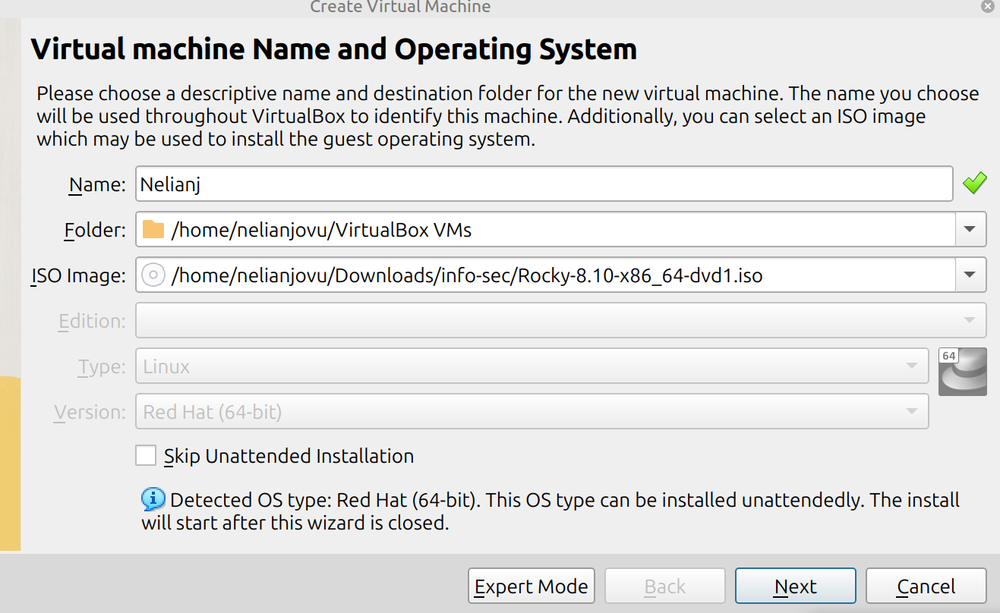{#fig:001 width=70%}

## Выполнение лабораторной работы

Я выбрала имя пользователя и имя хоста(рис.2)

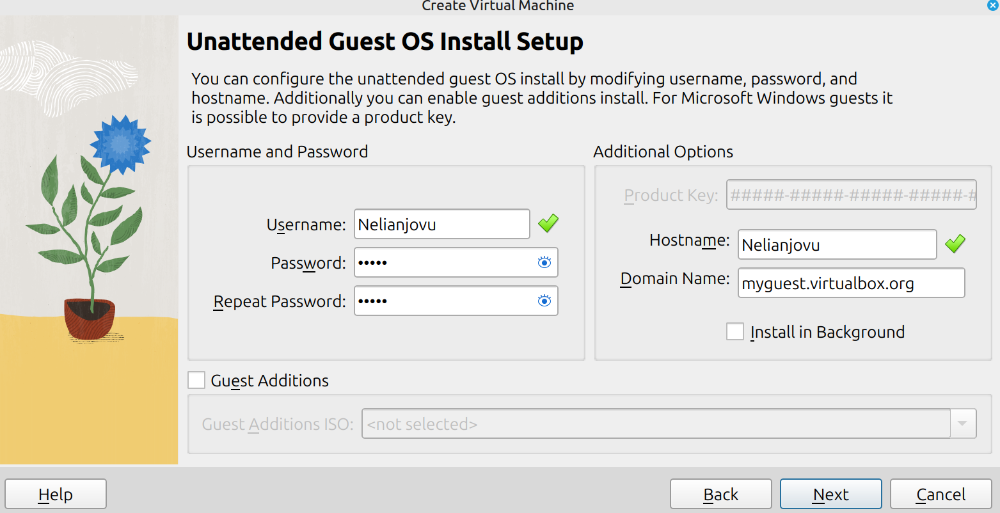{#fig:001 width=70%}

## Выполнение лабораторной работы

Я указывала размер основной памяти виртуальной машины и выбрала количество процессора(рис.3)

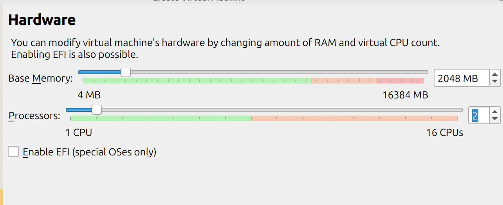{#fig:001 width=70%}

## Выполнение лабораторной работы

Я установила размер диска на 40ГБ(рис.4)

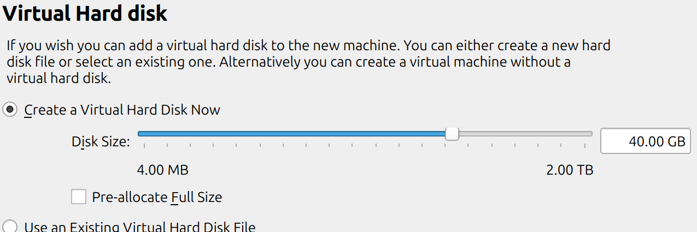{#fig:001 width=70%}

## Выполнение лабораторной работы

Проверяю подключен ли образ диска к носителю(рис.5)

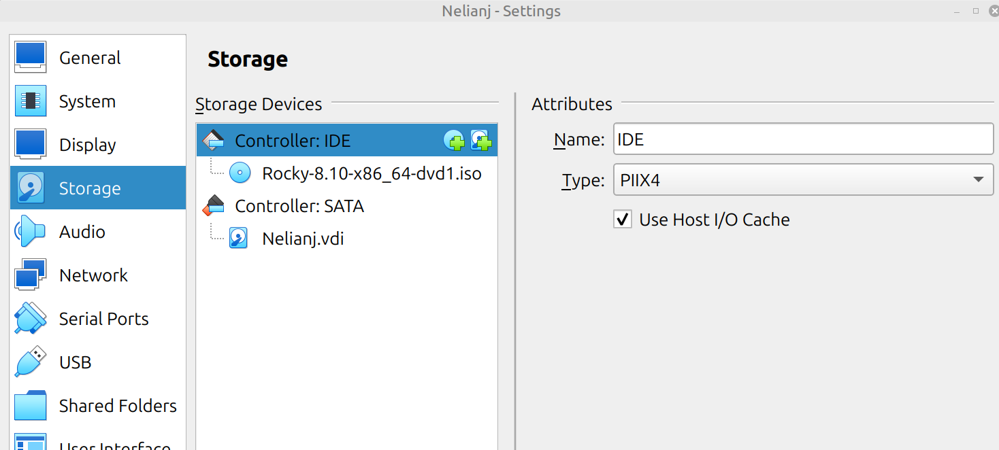{#fig:001 width=70%}

## Выполнение лабораторной работы

Я запускала виртуальную машину(рис.6)

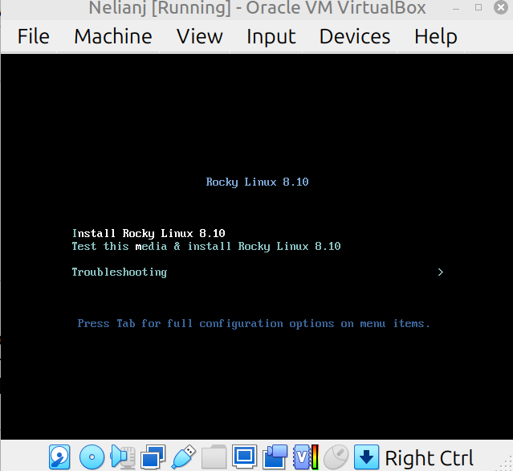{#fig:001 width=70%}

## Выполнение лабораторной работы

Я выбрала English в качестве языка интерфейс(рис.7)

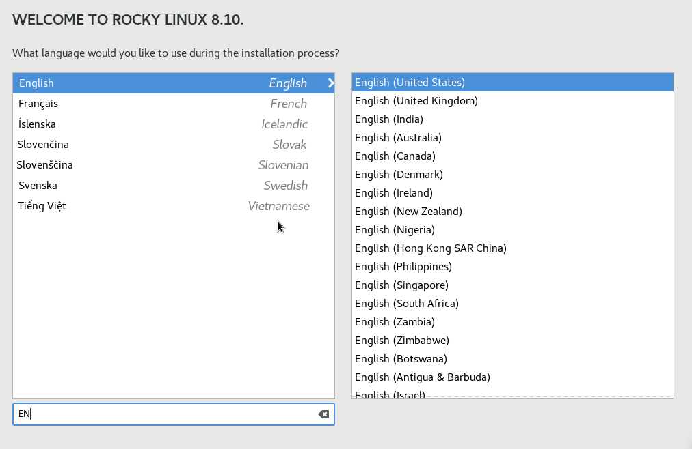{#fig:001 width=70%}

## Выполнение лабораторной работы

Я скорректировала часовой пояс и место(рис.8)

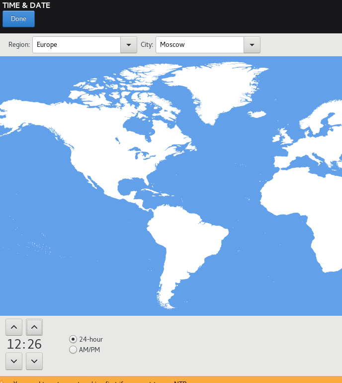{#fig:001 width=70%}

## Выполнение лабораторной работы

Я выбрала языки раскладки клавиатуры и задала комбинацию клавиш для переключения между раскладками клавиатуры (рис.9)

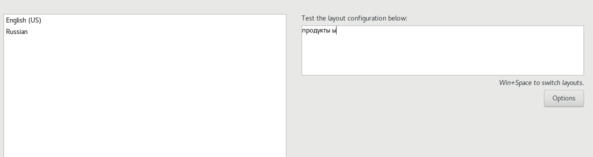{#fig:001 width=70%}

## Выполнение лабораторной работы

В разделе выбора программы в качестве базовой среды указывала Server with GUI, а в качестве дополнения - Development tools(рис.10)

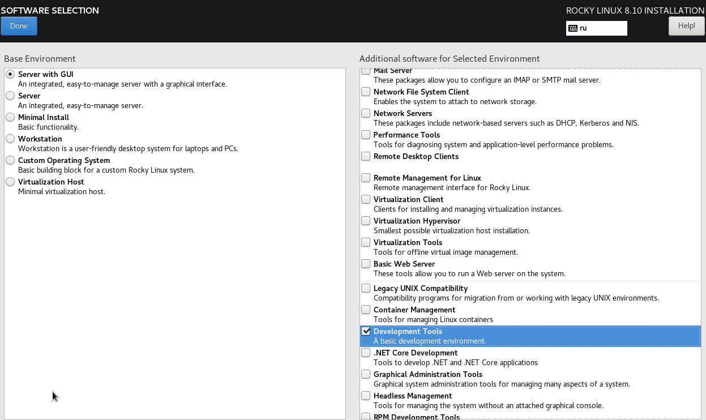{#fig:001 width=70%}

## Выполнение лабораторной работы

Я отключила KDUMP (рис.11)

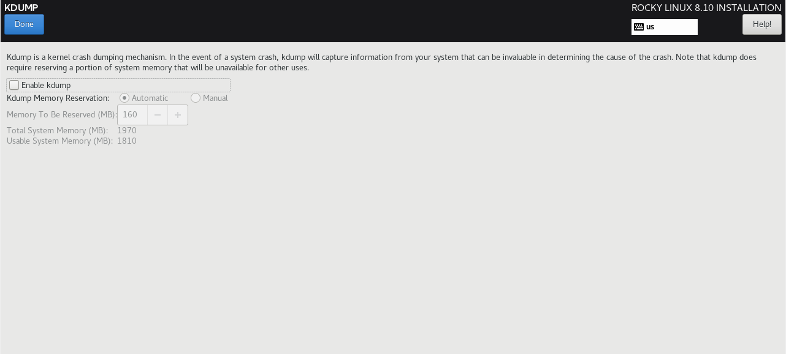{#fig:001 width=70%}

## Выполнение лабораторной работы

Я включила сетевое подключение и задала имя хоста(рис.12)

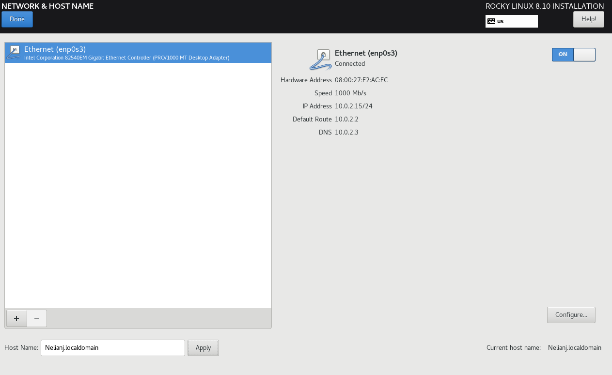{#fig:001 width=70%}

## Выполнение лабораторной работы

Я установила пароль для root и пользователя с правами администратора(рис.13)

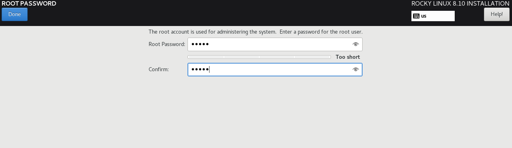{#fig:001 width=70%}

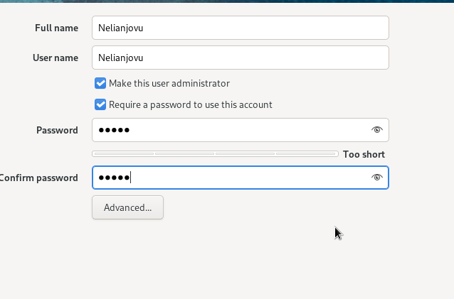{#fig:001 width=70%}

## Выполнение лабораторной работы

После завершения установки операционной системы я перезагрузилая и запустила виртуальную машину(рис.14)

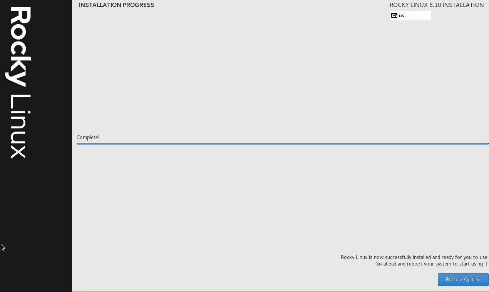{#fig:001 width=70%}

## Выполнение лабораторной работы

В VirtualBox оптический привод должен автоматически отключиться(рис.15)

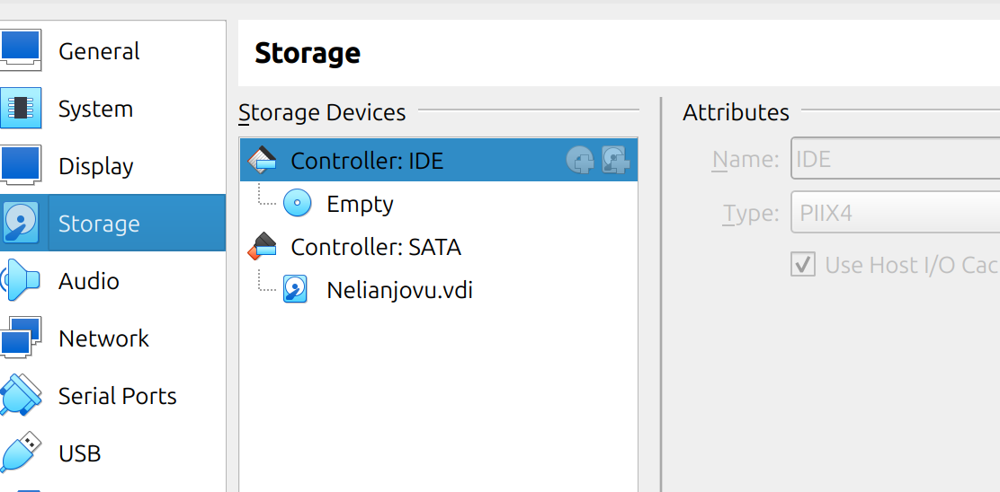{#fig:001 width=70%}

## Выполнение лабораторной работы

Я вошла в ОС, используя учетную запись, созданную во время установки(рис.16)

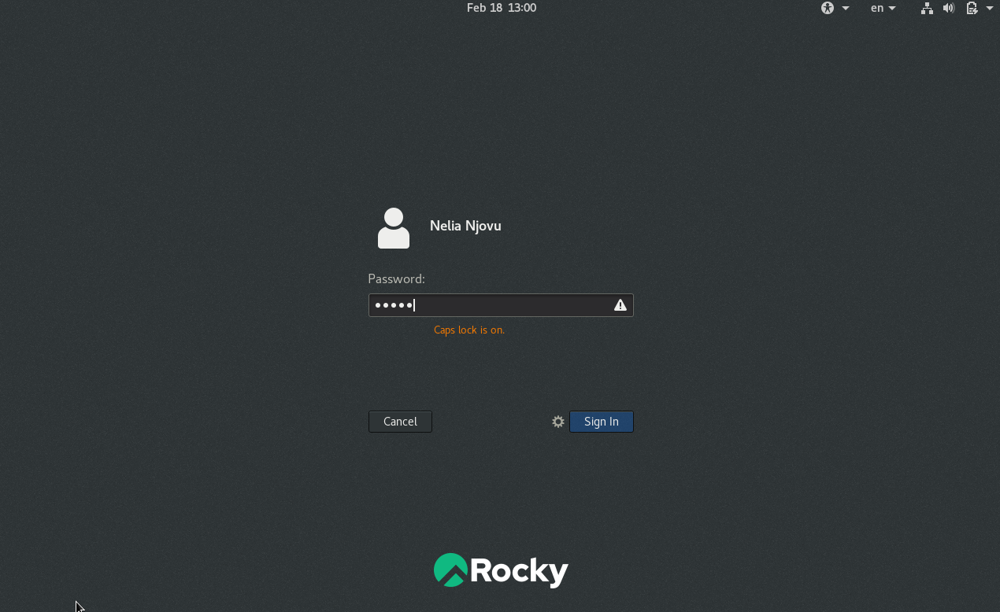{#fig:001 width=70%}

## Выполнение дополнительного задания

Я открывала терминал и запускала команда dmesg | less(рис.17)

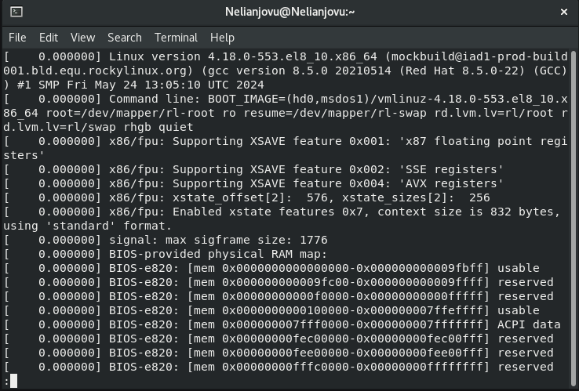{#fig:001 width=70%}

## Выполнение дополнительного задания

Я использовала поиск с помощью grep-dmesg | grep -i "то, что ищем", и получила следующую информацию:

Версия ядра Linux (Linux version)(рис.18)

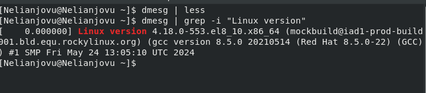{#fig:001 width=70%}

## Выполнение дополнительного задания

Частота процессора (Detected Mhz processor)(рис.19)

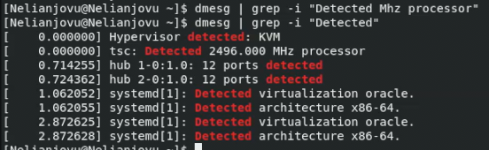{#fig:001 width=70%}

## Выполнение дополнительного задания

Модель процессора (CPU0)(рис.20)

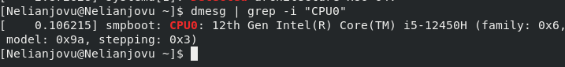{#fig:001 width=70%}

## Выполнение дополнительного задания

Объем доступной оперативной памяти (Memory available)(рис.21)

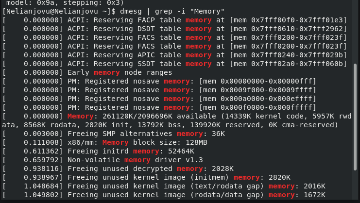{#fig:001 width=70%}
Структура научной презентации
## Выполнение дополнительного задания

Тип обнаруженного гипервизора (Hypervisor detected)(рис.22)

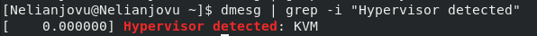{#fig:001 width=70%}

## Выполнение дополнительного задания

Тип файловой системы корневого раздела(рис.23)

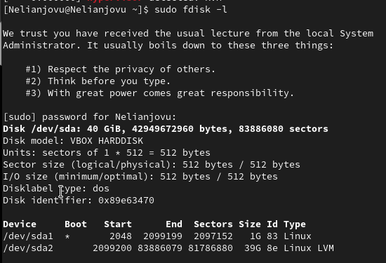{#fig:001 width=70%}

## Выполнение дополнительного задания

Последовательность монтирования файловых систем

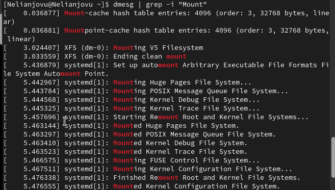{#fig:001 width=70%}

## Выводы

Выполнив эту лабораторной работы, я приобрела практических навыков установки операционной системы на виртуальную машину и настройки минимально необходимых для дальнейшей работы сервисов.
