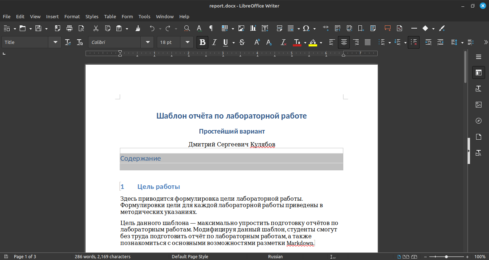
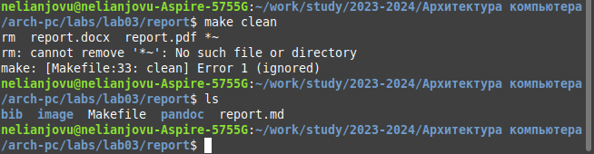

---
## Front matter
title: "Отчёта по лабораторной работе No1"
subtitle: "Основы информационной безопасности"
author: "Нджову Нелиа, НКАбд-02-23"

## Generic otions
lang: ru-RU
toc-title: "Содержание"

## Bibliography
bibliography: bib/cite.bib
csl: pandoc/csl/gost-r-7-0-5-2008-numeric.csl

## Pdf output format
toc: true # Table of contents
toc-depth: 2
lof: true # List of figures
lot: true # List of tables
fontsize: 12pt
linestretch: 1.5
papersize: a4
documentclass: scrreprt
## I18n polyglossia
polyglossia-lang:
  name: russian
  options:
	- spelling=modern
	- babelshorthands=true
polyglossia-otherlangs:
  name: english
## I18n babel
babel-lang: russian
babel-otherlangs: english
## Fonts
mainfont: PT Serif
romanfont: PT Serif
sansfont: PT Sans
monofont: PT Mono
mainfontoptions: Ligatures=TeX
romanfontoptions: Ligatures=TeX
sansfontoptions: Ligatures=TeX,Scale=MatchLowercase
monofontoptions: Scale=MatchLowercase,Scale=0.9
## Biblatex
biblatex: true
biblio-style: "gost-numeric"
biblatexoptions:
  - parentracker=true
  - backend=biber
  - hyperref=auto
  - language=auto
  - autolang=other*
  - citestyle=gost-numeric
## Pandoc-crossref LaTeX customization
figureTitle: "Рис."
tableTitle: "Таблица"
listingTitle: "Листинг"
lofTitle: "Список иллюстраций"
lotTitle: "Список таблиц"
lolTitle: "Листинги"
## Misc options
indent: true
header-includes:
  - \usepackage{indentfirst}
  - \usepackage{float} # keep figures where there are in the text
  - \floatplacement{figure}{H} # keep figures where there are in the text
---

# Цель работы

Целью данной работы является приобретение практических навыков установки операционной системы на виртуальную машину, настройки минимально необходимых для дальнейшей работы сервисов.

# Задание

1. Установка и настройка операционной системы.

2. Найти следующую информацию:
    1. Версия ядра Linux (Linux version).

    2. Частота процессора (Detected Mhz processor).

    3. Модель процессора (CPU0).

    4. Объем доступной оперативной памяти (Memory available).

    5. Тип обнаруженного гипервизора (Hypervisor detected).

    6. Тип файловой системы корневого раздела

# Выполнение лабораторной работы

Я создала новую виртуальную машину, указивая имя и образ ISO(рис.1).

{#fig:001 width=70%}

Я выбрала имя пользователя и имя хоста(рис.2)

{#fig:001 width=70%}

Я указывала размер основной памяти виртуальной машины и выбрала количество процессора(рис.3)

{#fig:001 width=70%}

Я установила размер диска на 40ГБ(рис.4)

{#fig:001 width=70%}

Проверяю подключен ли образ диска к носителю(рис.5)

{#fig:001 width=70%}

Я запускала виртуальную машину(рис.6)

{#fig:001 width=70%}

Я выбрала English в качестве языка интерфейс(рис.7)

{#fig:001 width=70%}

Я скорректировала часовой пояс и место(рис.8)

{#fig:001 width=70%}

Я выбрала языки раскладки клавиатуры и задала комбинацию клавиш для переключения между раскладками клавиатуры (рис.9)

{#fig:001 width=70%}

В разделе выбора программы в качестве базовой среды указывала Server with GUI, а в качестве дополнения - Development tools(рис.10)

{#fig:001 width=70%}

Я отключила KDUMP (рис.11)

{#fig:001 width=70%}

Я включила сетевое подключение и задала имя хоста(рис.12)

{#fig:001 width=70%}

Я установила пароль для root и пользователя с правами администратора(рис.13)

{#fig:001 width=70%}

{#fig:001 width=70%}

После завершения установки операционной системы я перезагрузилая и запустила виртуальную машину(рис.14)

{#fig:001 width=70%}

В VirtualBox оптический привод должен автоматически отключиться(рис.15)

{#fig:001 width=70%}

Я вошла в ОС, используя учетную запись, созданную во время установки(рис.16)

{#fig:001 width=70%}

# Выполнение дополнительного задания

Я открывала терминал и запускала команда dmesg | less(рис.17)

{#fig:001 width=70%}

Я использовала поиск с помощью grep-dmesg | grep -i "то, что ищем", и получила следующую информацию:

Версия ядра Linux (Linux version)(рис.18)

{#fig:001 width=70%}

Частота процессора (Detected Mhz processor)(рис.19)

{#fig:001 width=70%}

Модель процессора (CPU0)(рис.20)

{#fig:001 width=70%}

Объем доступной оперативной памяти (Memory available)(рис.21)

{#fig:001 width=70%}

Тип обнаруженного гипервизора (Hypervisor detected)(рис.22)

{#fig:001 width=70%}

Тип файловой системы корневого раздела(рис.23)

{#fig:001 width=70%}

Последовательность монтирования файловых систем

{#fig:001 width=70%}

# Ответы на контрольные вопросы

1. Учетная запись содержит необходимые для идентификации пользователя при подключении к системе данные, а так же информацию для авторизации и учета: системного имени (user name) (оно может содержать только латинские буквы и знак нижнее подчеркивание, еще оно должно быть уникальным), идентификатор пользователя (UID) (уникальный идентификатор пользователя в системе, целое положительное число), идентификатор группы (CID) (группа, к к-рой относится пользователь. Она, как минимум, одна, по умолчанию - одна), полное имя (full name) (Могут быть ФИО), домашний каталог (home directory) (каталог, в к-рый попадает пользователь после входа в систему и в к-ром хранятся его данные), начальная оболочка (login shell) (командная оболочка, к-рая запускается при входе в систему).

2. Для получения справки по команде: —help; для перемещения по файловой системе - cd; для просмотра содержимого каталога - ls; для определения объёма каталога - du ; для создания / удаления каталогов - mkdir/rmdir; для создания / удаления файлов - touch/rm; для задания определённых прав на файл / каталог - chmod; для просмотра истории команд - history

3. Файловая система - это порядок, определяющий способ организации и хранения и именования данных на различных носителях информации. Примеры: FAT32 представляет собой пространство, разделенное на три части: олна область для служебных структур, форма указателей в виде таблиц и зона для хранения самих файлов. ext3/ext4 - журналируемая файловая система, используемая в основном в ОС с ядром Linux.

4. С помощью команды df, введя ее в терминале. Это утилита, которая показывает список всех файловых систем по именам устройств, сообщает их размер и данные о памяти. Также посмотреть подмонтированные файловые системы можно с помощью утилиты mount.

5. Чтобы удалить зависший процесс, вначале мы должны узнать, какой у него id: используем команду ps. Далее в терминале вводим команду kill < id процесса >. Или можно использовать утилиту killall, что “убьет” все процессы, которые есть в данный момент, для этого не нужно знать id процесса.

# Выводы

Выполнив эту лабораторной работы, я приобрела практических навыков установки операционной системы на виртуальную машину и настройки минимально необходимых для дальнейшей работы сервисов.

# Список литературы{.unnumbered}

001-lab_virtualbox.pdf - Кулябов Д. С., Королькова А. В., Геворкян М. Н.
