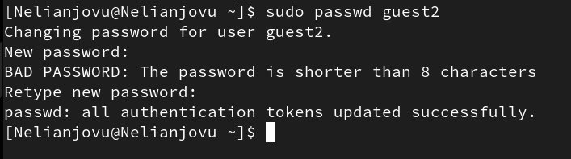

---
## Front matter
title: "Отчёта по лабораторной работе 3"
subtitle: "Основы информационной безопасности"
author: "Нджову Нелиа"

## Generic otions
lang: ru-RU
toc-title: "Содержание"

## Bibliography
bibliography: bib/cite.bib
csl: pandoc/csl/gost-r-7-0-5-2008-numeric.csl

## Pdf output format
toc: true # Table of contents
toc-depth: 2
lof: true # List of figures
lot: true # List of tables
fontsize: 12pt
linestretch: 1.5
papersize: a4
documentclass: scrreprt
## I18n polyglossia
polyglossia-lang:
  name: russian
  options:
	- spelling=modern
	- babelshorthands=true
polyglossia-otherlangs:
  name: english
## I18n babel
babel-lang: russian
babel-otherlangs: english
## Fonts
mainfont: PT Serif
romanfont: PT Serif
sansfont: PT Sans
monofont: PT Mono
mainfontoptions: Ligatures=TeX
romanfontoptions: Ligatures=TeX
sansfontoptions: Ligatures=TeX,Scale=MatchLowercase
monofontoptions: Scale=MatchLowercase,Scale=0.9
## Biblatex
biblatex: true
biblio-style: "gost-numeric"
biblatexoptions:
  - parentracker=true
  - backend=biber
  - hyperref=auto
  - language=auto
  - autolang=other*
  - citestyle=gost-numeric
## Pandoc-crossref LaTeX customization
figureTitle: "Рис."
tableTitle: "Таблица"
listingTitle: "Листинг"
lofTitle: "Список иллюстраций"
lotTitle: "Список таблиц"
lolTitle: "Листинги"
## Misc options
indent: true
header-includes:
  - \usepackage{indentfirst}
  - \usepackage{float} # keep figures where there are in the text
  - \floatplacement{figure}{H} # keep figures where there are in the text
---

# Цель работы

Получение практических навыков работы в консоли с атрибутами файлов для групп пользователей1

# Задание

1. Создание пользователя guest2, добавление его в группу пользователей guest.

2. Заполнение таблицы 3.1

3. Заполнение таблицы 3.2 на основе таблицы 3.1

# Выполнение лабораторной работы

**1. Создание пользователя guest2, добавление его в группу пользователей guest.**

В предыдущей лабораторной работе, в установленной операционной системе, я создала учётную запись guest с помощью команды useradd guest. А также установила пароль для пользователя guest с помощью команду passwd guest. Я делаю то же самое, чтобы создать guest2(рис.1 и рис.2).

{#fig:001 width=70%}

{#fig:001 width=70%}

Я добавляю пользователя guest2 в группу guest, используя команду group gpasswd -a guest2 guest(рис.3)

{#fig:001 width=70%}

Я вхожу в систему от двух пользователей на двух разных консолях, guest на первой консоли и guest2 на второй консоли. Используя команду su username(рис.4)

{#fig:001 width=70%}

Для обоих пользователей я использую команду pwd, чтобы определить каталог, в котором я нахожусь. Текущая директория с приглашением командной строки совпадает.(рис.5 и рис.6)

{#fig:001 width=70%}

{#fig:001 width=70%}

Я проверяю имя пользователей с поомощью команды whoami, с помощью команды id могу увидеть группы, к которым принадлежит пользователь и коды этих групп (gid), команда groups просто выведет список групп, в которые входит пользователь. id -Gn - выведет названия групп, которым принадлежит пользовател. id -G - выведет только код групп, которым принадлежит пользователь(рис.7 и рис.8)

{#fig:001 width=70%}

{#fig:001 width=70%}

Затем я отображаю содержимое файла etc/group, в котором показано, что в группе guest есть два пользователя, а в группе guest2 — один(рис.9)

{#fig:001 width=70%}

Я регистрирую guest2 в группе guest с помощью команды newgrp (рис.10)

{#fig:001 width=70%}

Я добавляю права на чтение, запись и выполнение группам пользователей guest(и guest2) в каталоге home/guest, в котором находятся все файлы для последующей работы (рис.11)

{#fig:001 width=70%}

В пользователе guest я удаляю все атрибуты из каталога dir1, созданного в предыдущей лабораторной работе. Проверяю, что права действительно были удалены(рис.12)

{#fig:001 width=70%}

**2. Заполнение таблицы 3.1**

Далее я проверяю как пользователь guest2 будет взаимодействовать с файлами в этой директории(рис.13)

{#fig:001 width=70%}

| | | | | | | | | | |
|-|-|-|-|-|-|-|-|-|-|
|Права директории|Права файла|Создание файла|Удаление файла|Запись в файл|Чтение файла|Смена директории|Просмотр файлов в директории|Переименование файл|Смена атрибутов файла|
|d-------—(000)|--------—(000)|-|-|-|-|-|-|-|-|
|d-----x-—(010)|--------—(000)|-|-|-|-|-|-|-|+|
|d----w--—(020)|--------—(000)|-|-|-|-|-|-|-|-|
|d----wx-—(030)|--------—(000)|+|+|-|-|+|-|+|+|
|d---r---—(040)|--------—(000)|-|-|-|-|-|+|-|-|
|d---r-x-—(050)|--------—(000)|-|-|-|-|+|+|-|+|
|d---rw--—(060)|--------—(000)|-|-|-|-|-|+|-|-|
|d---rwx-—(070)|--------—(000)|+|+|-|-|+|+|+|+|
|d-------—(000)|------x-—(010)|-|-|-|-|-|-|-|-|
|d-----x-—(010)|------x-—(010)|-|-|-|-|-|-|-|+|
|d----w--—(020)|------x-—(010)|-|-|-|-|-|-|-|-|
|d----wx-—(030)|------x-—(010)|+|+|-|-|+|-|+|+|
|d---r---—(040)|------x-—(010)|-|-|-|-|-|+|-|-|
|d---r-x-—(050)|------x-—(010)|-|-|-|-|+|+|-|+|
|d---rw--—(060)|------x-—(010)|-|-|-|-|-|+|-|-|
|d---rwx-—(070)|------x-—(010)|+|+|-|-|+|+|+|+|
|d-------—(000)|-----w--—(020)|-|-|-|-|-|-|-|-|
|d-----x-—(010)|-----w--—(020)|-|-|+|-|-|-|-|+|
|d----w--—(020)|-----w--—(020)|-|-|-|-|-|-|-|-|
|d----wx-—(030)|-----w--—(020)|+|+|+|-|+|-|+|+|
|d---r---—(040)|-----w--—(020)|-|-|-|-|-|+|-|-|
|d---r-x-—(050)|-----w--—(020)|-|-|+|-|+|+|-|+|
|d---rw--—(060)|-----w--—(020)|-|-|-|-|-|+|-|-|
|d---rwx-—(070)|-----w--—(020)|+|+|+|-|+|+|+|+|
|d-------—(000)|-----wx-—(030)|-|-|-|-|-|-|-|-|
|d-----x-—(010)|-----wx-—(030)|-|-|+|-|-|-|-|+|
|d----w--—(020)|-----wx-—(030)|-|-|-|-|-|-|-|-|
|d----wx-—(030)|-----wx-—(030)|+|+|+|-|+|-|+|+|
|d---r---—(040)|-----wx-—(030)|-|-|-|-|-|+|-|-|
|d---r-x-—(050)|-----wx-—(030)|-|-|+|-|+|+|-|+|
|d---rw--—(060)|-----wx-—(030)|-|-|-|-|-|+|-|-|
|d---rwx-—(070)|-----wx-—(030)|+|+|+|-|+|+|+|+|
|d-------—(000)|----r---—(040)|-|-|-|-|-|-|-|-|
|d-----x-—(010)|----r---—(040)|-|-|-|+|+|-|-|+|
|d----w--—(020)|----r---—(040)|-|-|-|-|-|-|-|-|
|d----wx-—(030)|----r---—(040)|+|+|-|+|+|-|+|+|
|d---r---—(040)|----r---—(040)|-|-|-|-|-|+|-|-|
|d---r-x-—(050)|----r---—(040)|-|-|-|+|+|+|-|+|
|d---rw--—(060)|----r---—(040)|-|-|-|-|-|+|-|-|
|d---rwx-—(070)|----r---—(040)|+|+|-|+|+|+|+|+|
|d-------—(000)|----r-x-—(050)|-|-|-|-|-|-|-|-|
|d-----x-—(010)|----r-x-—(050)|-|-|-|+|+|-|-|+|
|d----w--—(020)|----r-x-—(050)|-|-|-|-|-|-|-|-|
|d----wx-—(030)|----r-x-—(050)|+|+|-|+|+|-|+|+|
|d---r---—(040)|----r-x-—(050)|-|-|-|-|-|+|-|-|
|d---r-x-—(050)|----r-x-—(050)|-|-|-|+|+|+|-|+|
|d---rw--—(060)|----r-x-—(050)|-|-|-|-|-|+|-|-|
|d---rwx-—(070)|----r-x-—(050)|+|+|-|+|+|+|+|+|
|d-------—(000)|----rw--—(060)|-|-|-|-|-|-|-|-|
|d-----x-—(010)|----rw--—(060)|-|-|+|+|-|-|-|+|
|d----w--—(020)|----rw--—(060)|-|-|-|-|-|-|-|-|
|d----wx-—(030)|----rw--—(060)|+|+|+|+|+|-|+|+|
|d---r---—(040)|----rw--—(060)|-|-|-|-|-|+|-|-|
|d---r-x-—(050)|----rw--—(060)|-|-|+|+|+|+|-|+|
|d---rw--—(060)|----rw--—(060)|-|-|-|-|-|+|-|-|
|d---rwx-—(070)|----rw--—(060)|+|+|+|+|+|+|+|+|
|d-------—(000)|----rwx-—(070)|-|-|-|-|-|-|-|-|
|d-----x-—(010)|----rwx-—(070)|-|-|+|+|+|-|-|+|
|d----w--—(020)|----rwx-—(070)|-|-|-|-|-|-|-|-|
|d----wx-—(030)|----rwx-—(070)|+|+|+|+|+|-|+|+|
|d---r---—(040)|----rwx-—(070)|-|-|-|-|-|+|-|-|
|d---r-x-—(050)|----rwx-—(070)|-|-|+|+|+|+|-|+|
|d---rw--—(060)|----rwx-—(070)|-|-|-|-|-|+|-|-|
|d---rwx-—(070)|----rwx-—(070)|+|+|+|+|+|+|+|+|

Таблица 3.1 «Установленные права и разрешённые действия для групп»

**3. Заполнение таблицы 3.2 на основе таблицы 3.1**

| | | |
|-|-|-|
|Операция|Права на директорию|Права на файл|
|Создание файла|d----wx-—(030)|--------—(000)|
|Удаление файла|d----wx-—(030)|--------—(000)|
|Чтение файла|d-----x-—(010)|----r---— (040)|
|Запись в файл|d-----x-—(010)|-----w--—(020)|
|Переименование файла|d----wx-—(030)|--------—(000)|
|Создание поддиректории|d----wx-—(030)|--------—(000)|
|Удаление поддиректории|d----wx-—(030)|--------—(000)|

Таблица 3.2 «Минимальные права для совершения операций от имени пользователей входящих в группу»

# Выводы

Выполнив эту работе, я получила практические навыки работы в консоли с атрибутами файлов для групп пользователей1

