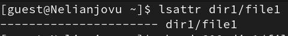
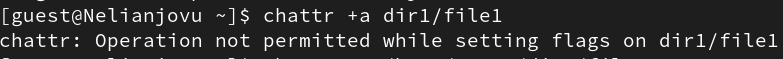
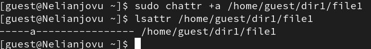
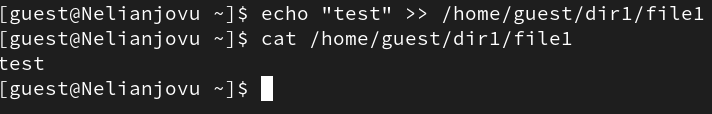
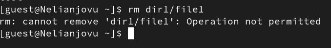
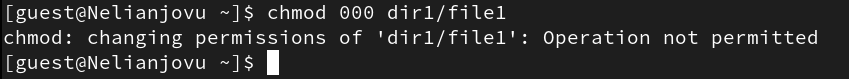
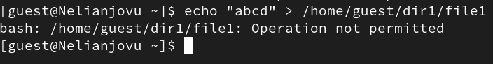
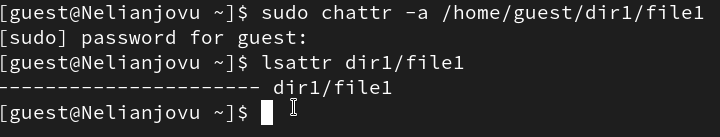
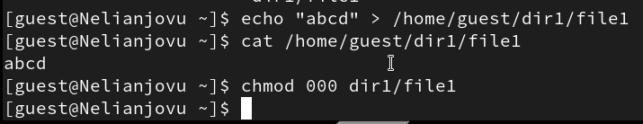
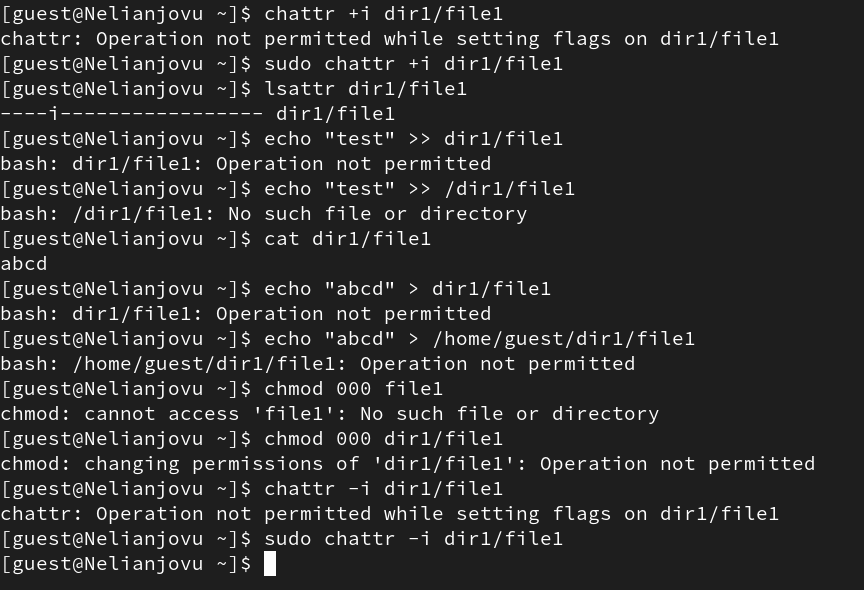

---
## Front matter
lang: ru-RU
title: Презентация по лабораторной работе 4
subtitle: Основной Информационной Безопасности
author:
  - Нджову Н.
institute:
  - Российский университет дружбы народов, Москва, Россия
date: 02 апреля 2025

## i18n babel
babel-lang: russian
babel-otherlangs: english

## Formatting pdf
toc: false
toc-title: Содержание
slide_level: 2
aspectratio: 169
section-titles: true
theme: metropolis
header-includes:
 - \metroset{progressbar=frametitle,sectionpage=progressbar,numbering=fraction}
 - '\makeatletter'
 - '\beamer@ignorenonframefalse'
 - '\makeatother'
---

## Цель работы

Получение практических навыков работы в консоли с расширенными атрибутами файлов

## Задание

1. Работа с расширенными атрибутами файлов

## Выполнение лабораторной работы

От имени пользователя guest, я определяю расширенные атрибуты файла dir1/file1(рис.1)

{#fig:001 width=70%}

## Выполнение лабораторной работы

Я пробую установить на файл dir1/file1 расширенный атрибут +а(только добавление. Удаление и переименование запрещено) от имени пользователя guest, в ответ получаю отказ от выполнения операции(рис.2)

{#fig:001 width=70%}

## Выполнение лабораторной работы

Я установливаю расширенные права уже от имени суперпользователя и это получилось(рис.3)

{#fig:001 width=70%}

## Выполнение лабораторной работы

Я выполняю дозапись в файл с помощью echo 'test' >> dir1/file1, далее я выполняю чтение файла, убеждаюсь, что дозапись была выполнена(рис.4)

{#fig:001 width=70%}

## Выполнение лабораторной работы

Я пробую удалить файл, получаю отказ от выполнения действия(рис.5)

{#fig:001 width=70%}

## Выполнение лабораторной работы

Я получаю отказ от выполнения при попытке установить права доступа(рис.6)

{#fig:001 width=70%}

## Выполнение лабораторной работы

Я также пытаюсь стереть содержащуюся в нем информацию и написать в нем "abcd", но он отказывается(рис.7)

{#fig:001 width=70%}

## Выполнение лабораторной работы

Я снимаю расширенные атрибуты с файла(рис.8)

{#fig:001 width=70%}

## Выполнение лабораторной работы

Я проверяю ранее не удавшиеся действия(чтение и изменение прав доступа).Теперь все из этого выполняется(рис.9)

{#fig:001 width=70%}

## Выполнение лабораторной работы

Я добавляю расширенный атрибут +i(неизменяемый файл) от имени суперпользователя и пытаюсь записать в файл, дозаписать, переименовать или удалить, ничего из этого сделать нельзя

{#fig:001 width=70%}

## Выводы

Выполнив эту работу, я получила практические навыки работы в консоли с расширенными атрибутами файлов

