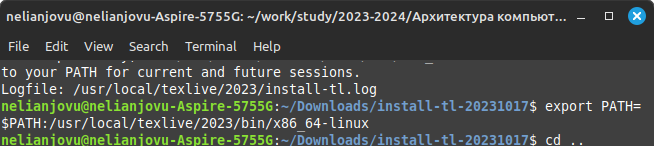

---
## Front matter
title: "Отчёт по лабораторной работе 4"
subtitle: "Основной Информационной Безопасности"
author: "Нджову Нелиа"

## Generic otions
lang: ru-RU
toc-title: "Содержание"

## Bibliography
bibliography: bib/cite.bib
csl: pandoc/csl/gost-r-7-0-5-2008-numeric.csl

## Pdf output format
toc: true # Table of contents
toc-depth: 2
lof: true # List of figures
lot: true # List of tables
fontsize: 12pt
linestretch: 1.5
papersize: a4
documentclass: scrreprt
## I18n polyglossia
polyglossia-lang:
  name: russian
  options:
	- spelling=modern
	- babelshorthands=true
polyglossia-otherlangs:
  name: english
## I18n babel
babel-lang: russian
babel-otherlangs: english
## Fonts
mainfont: PT Serif
romanfont: PT Serif
sansfont: PT Sans
monofont: PT Mono
mainfontoptions: Ligatures=TeX
romanfontoptions: Ligatures=TeX
sansfontoptions: Ligatures=TeX,Scale=MatchLowercase
monofontoptions: Scale=MatchLowercase,Scale=0.9
## Biblatex
biblatex: true
biblio-style: "gost-numeric"
biblatexoptions:
  - parentracker=true
  - backend=biber
  - hyperref=auto
  - language=auto
  - autolang=other*
  - citestyle=gost-numeric
## Pandoc-crossref LaTeX customization
figureTitle: "Рис."
tableTitle: "Таблица"
listingTitle: "Листинг"
lofTitle: "Список иллюстраций"
lotTitle: "Список таблиц"
lolTitle: "Листинги"
## Misc options
indent: true
header-includes:
  - \usepackage{indentfirst}
  - \usepackage{float} # keep figures where there are in the text
  - \floatplacement{figure}{H} # keep figures where there are in the text
---

# Цель работы

Получение практических навыков работы в консоли с расширенными атрибутами файлов

# Задание

1. Работа с расширенными атрибутами файлов

# Теоретическое введение

Права доступа определяют, какие действия конкретный пользователь может или не может совершать с определенным файлами и каталогами.

Расширенные атрибуты файлов Linux представляют собой пары имя:значение, которые постоянно связаны с файлами и каталогами, подобно тому как строки окружения связаны с процессом

Установить атрибуты:

• chattr filename

Значения:

• chattr +a - только добавление. Удаление и переименование запрещено

• chattr +A - не фиксировать данные об обращении к файлу

• chattr +c - сжатый файл

• chattr +d - неархивируемый файл

• chattr +i - неизменяемый файл

• chattr +S - синхронное обновление

• chattr +s - безопасное удаление, (после удаления место на диске переписывается нулями)

• chattr +u - неудаляемый файл

• chattr -R - рекурсия

Просмотреть атрибуты:

• lsattr filename

Опции:

• lsattr -R - рекурсия

• lsattr -a - вывести все файлы (включая скрытые)

• lsattr -d - не выводить содержимое директории

# Выполнение лабораторной работы

От имени пользователя guest, я определяю расширенные атрибуты файла dir1/file1(рис.1)

{#fig:001 width=70%}

Я пробую установить на файл dir1/file1 расширенный атрибут +а от имени пользователя guest, в ответ получаю отказ от выполнения операции(рис.2)

{#fig:001 width=70%}

Я установливаю расширенные права уже от имени суперпользователя и это получилось(рис.3)

{#fig:001 width=70%}

Я выполняю дозапись в файл с помощью echo 'test' >> dir1/file1, далее я выполняю чтение файла, убеждаюсь, что дозапись была выполнена(рис.4)

{#fig:001 width=70%}

Я пробую удалить файл, получаю отказ от выполнения действия(рис.5)

{#fig:001 width=70%}

Я получаю отказ от выполнения при попытке установить права доступа(рис.6)

{#fig:001 width=70%}

Я также пытаюсь стереть содержащуюся в нем информацию и написать в нем "abcd", но он отказывается(рис.7)

{#fig:001 width=70%}

Я снимаю расширенные атрибуты с файла(рис.8)

{#fig:001 width=70%}

Я проверяю ранее не удавшиеся действия(чтение и изменение прав доступа).Теперь все из этого выполняется(рис.9)

{#fig:001 width=70%}

Я добавляю расширенный атрибут +i от имени суперпользователя и пытаюсь записать в файл, дозаписать, переименовать или удалить, ничего из
этого сделать нельзя

{#fig:001 width=70%}

# Выводы

Выполнив эту работу, я получила практические навыки работы в консоли с расширенными атрибутами файлов

# Список литературы{.unnumbered}

004-lab_discret_extattr.pdf
