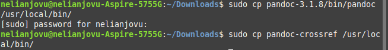
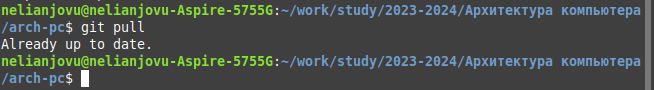
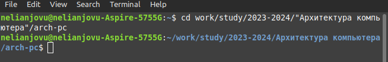
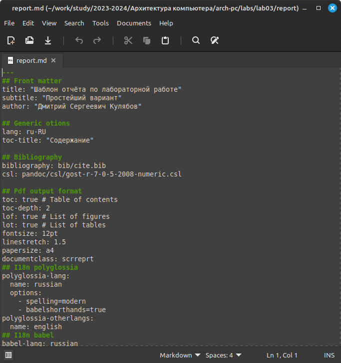
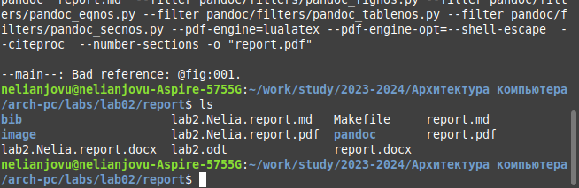
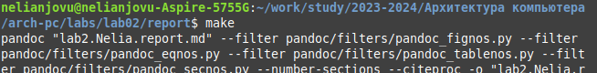
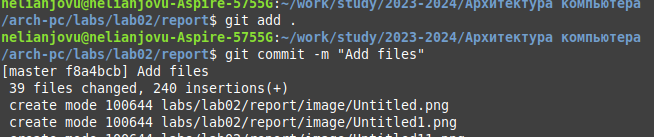

---
## Front matter
title: "Отчёт по лабораторной работе 5"
subtitle: "Основы информационной безопасности"
author: "Нджову Нелиа"

## Generic otions
lang: ru-RU
toc-title: "Содержание"

## Bibliography
bibliography: bib/cite.bib
csl: pandoc/csl/gost-r-7-0-5-2008-numeric.csl

## Pdf output format
toc: true # Table of contents
toc-depth: 2
lof: true # List of figures
lot: true # List of tables
fontsize: 12pt
linestretch: 1.5
papersize: a4
documentclass: scrreprt
## I18n polyglossia
polyglossia-lang:
  name: russian
  options:
	- spelling=modern
	- babelshorthands=true
polyglossia-otherlangs:
  name: english
## I18n babel
babel-lang: russian
babel-otherlangs: english
## Fonts
mainfont: PT Serif
romanfont: PT Serif
sansfont: PT Sans
monofont: PT Mono
mainfontoptions: Ligatures=TeX
romanfontoptions: Ligatures=TeX
sansfontoptions: Ligatures=TeX,Scale=MatchLowercase
monofontoptions: Scale=MatchLowercase,Scale=0.9
## Biblatex
biblatex: true
biblio-style: "gost-numeric"
biblatexoptions:
  - parentracker=true
  - backend=biber
  - hyperref=auto
  - language=auto
  - autolang=other*
  - citestyle=gost-numeric
## Pandoc-crossref LaTeX customization
figureTitle: "Рис."
tableTitle: "Таблица"
listingTitle: "Листинг"
lofTitle: "Список иллюстраций"
lotTitle: "Список таблиц"
lolTitle: "Листинги"
## Misc options
indent: true
header-includes:
  - \usepackage{indentfirst}
  - \usepackage{float} # keep figures where there are in the text
  - \floatplacement{figure}{H} # keep figures where there are in the text
---

# Цель работы

Изучение механизмов изменения идентификаторов, применения SetUID- и Sticky-битов. Получение практических навыков работы в консоли с дополнительными атрибутами. Рассмотрение работы механизма смены идентификатора процессов пользователей, а также влияние бита Sticky на запись и удаление файлов.

# Задание

1. Создание программы

2. Исследование Sticky-бита

# Выполнение лабораторной работы

**1. Создание программы**

Для этой лабораторной работы, вам необходимо проверить установлен ли компилятор(gcc), используя команду gcc -v. Также осуществляется отключение системы запретом с помощью setenforce 0(рис.1 и рис.2)

{#fig:001 width=70%}

{#fig:001 width=70%}

Я не мог использовать своего guest пользователя, потому что получила сообщение ошибке когда попробавала установить файл. Из за этого, я использовала суперпользователя, я создала файл simpled.c и записала в него код(рис.3 и рис.4)

{#fig:001 width=70%}

{#fig:001 width=70%}

Я скомпилировала файл, проверила что он скомпилирован(рис.5)

{#fig:001 width=70%}

Я запустила исполняемый файл. Номера пользователя и группы указаны в выходных данных файла, они отличаются от выходных данных команды id тем, что в выходных данных для исполняемого файла отображается меньше информации, чем в команде id(рис.6)

{#fig:001 width=70%}

Я создала, записывала в файл в simpled2.с(рис.7 и рис.8)

{#fig:001 width=70%}

{#fig:001 width=70%}

Я компилировала файл и запустила программы(рис.9)

{#fig:001 width=70%}

Я использовала chown, чтобы сменить владельца файла на суперпользователя, и chmod, чтобы изменить права доступа(рис.10)

{#fig:001 width=70%}

Я сравнила выходные данные программы и команды id, в очередной раз получила больше информации, используя команды id, чем наша программа(рис.11)

{#fig:001 width=70%}

Я создала, записывала в файл в readfile.с(рис.12 и рис.13)

{#fig:001 width=70%}

{#fig:001 width=70%}

Я компилировала файл(рис.14)

{#fig:001 width=70%}

И снова, от имени пользователя guest, я меняла владельца файла для чтения. Затем я меняла права доступа, чтобы пользователи Nelianjovu не мог прочитать содержимое файла(рис.15)

{#fig:001 width=70%}

Я попыталась прочитать содержимое файла readfile.с у пользователя Nelianjovu. Я не могу прочитать файл(рис.16)

{#fig:001 width=70%}

При попытке прочитать тот же файл с помощью программы readfile выдается сообщение “размытая информация”(рис.17)

{#fig:001 width=70%}

При попытке прочитать содержимое файла shadow с помощью программы readfile выдается тоже сообщение “размытая информация”(рис.18)

{#fig:001 width=70%}

При попытке прочитать содержимое файла shadow с помощью программы readfile от имени пользователя guest получилось(рис.19)

{#fig:001 width=70%}

**2. Исследование Sticky-бита**

Я проверила папку tmp на наличие атрибута Sticky, потому что в выходных данных есть буква t, значит, атрибут установлен(рис.20)

{#fig:001 width=70%}

От имени пользователя Nelianjovu создала файл с текстом, добавляла права на чтение и запись для других пользователей(рис.21)

{#fig:001 width=70%}

Вхожу в систему от имени пользователя guest2, от его имени перезаписать информацию в файле file 01.txt не могу(рис.22)

{#fig:001 width=70%}

От имени суперпользователя снимала с директории атрибут Sticky(рис.23)

{#fig:001 width=70%}

Я проверила, что атрибут действительно снят(рис.24)

{#fig:001 width=70%}

Далее я повторила предыдущие действия. Согласно результатам, запись в файл и повторная запись в файл оставались невозможными без Sticky-бита(рис.25)

{#fig:001 width=70%}

Затем я вернула каталог tmp с атрибутом t от имени суперпользователя(рис.26)

{#fig:001 width=70%}

# Выводы

Выполнив эту работу, я изучила механизмы изменения идентификаторов, применения SetUID- и Sticky-битов и получила практические навыки работы в консоли с дополнительными атрибутами. Рассмотрила работы механизма смены идентификатора процессов пользователей, а также влияние бита Sticky на запись и удаление файлов.

