---
## Front matter
lang: ru-RU
title: Презентация по лабораторной работе 6
subtitle: Основы информационной безопасности
author:
  - Нджову Н.
institute:
  - Российский университет дружбы народов, Москва, Россия
date: 01 мая 2025

## i18n babel
babel-lang: russian
babel-otherlangs: english

## Formatting pdf
toc: false
toc-title: Содержание
slide_level: 2
aspectratio: 169
section-titles: true
theme: metropolis
header-includes:
 - \metroset{progressbar=frametitle,sectionpage=progressbar,numbering=fraction}
 - '\makeatletter'
 - '\beamer@ignorenonframefalse'
 - '\makeatother'
---

## Цель работы

Развить навыки администрирования ОС Linux. Получить первое практическое знакомство с технологией SELinux1. Проверить работу SELinux на практике совместно с веб-сервером Apache.

## Выполнение лабораторной работы

Я вошла в свою учетную запись и убедилась, что SELinux работает в режиме принудительного применения целевой политики, используя команды getenforce и status(рис.1)

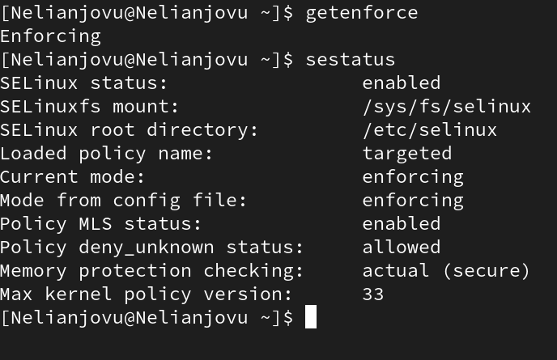{#fig:001 width=70%}

## Выполнение лабораторной работы

Я запускаю сервер apache, затем использую браузер для доступа к веб-серверу, запущенному на компьютере, он запущен, как видно из вывода команды service httpd status(рис.2)

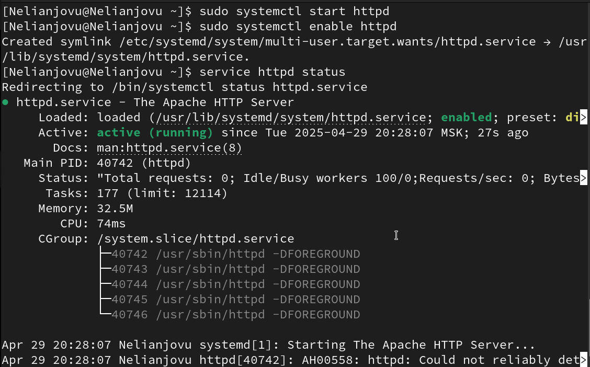{#fig:001 width=70%}

## Выполнение лабораторной работы

Я нашла веб-сервер Apache в списке процессов, используя команду ps aux | grep httpd. Его контекст безопасности - http_t(рис.3)

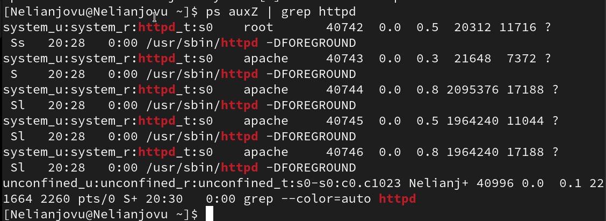{#fig:001 width=70%}

## Выполнение лабораторной работы

Я просмотрела текущее состояние коммутаторов SELinux для Apache, используя команду status -grep httpd(рис.4)

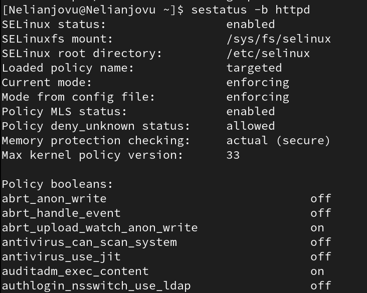{#fig:001 width=70%}

## Выполнение лабораторной работы

Я просмотрела статистику по политике, используя команду setinfo. Всего 8 пользователей, 39 ролей и 5135 типов(рис.5)

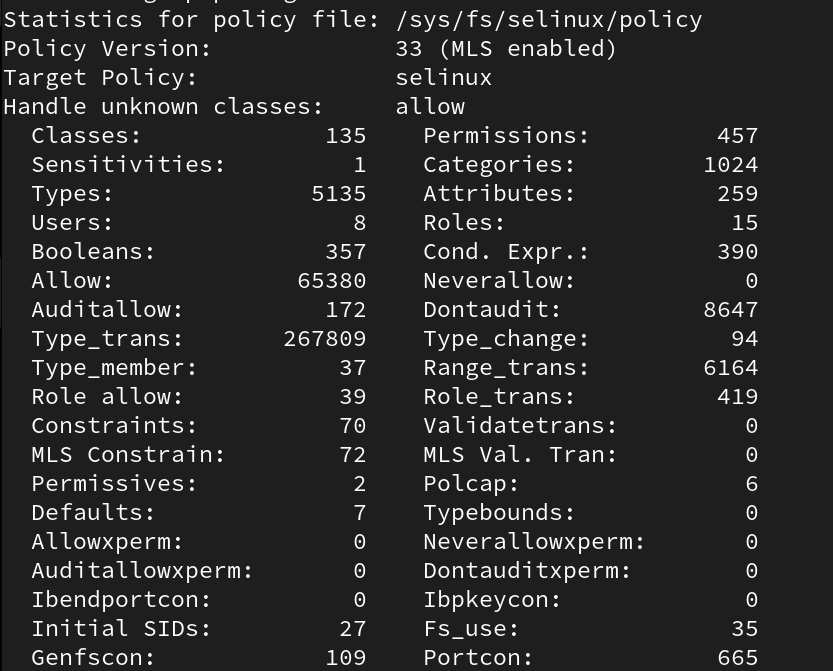{#fig:001 width=70%}

## Выполнение лабораторной работы

Типы подкаталогов, расположенных в каталоге /var/www с помощью команды ls - lZ /var/www, следующие: владельцем является root, только у владельца есть права на изменение. В каталоге нет файлов(рис.6)

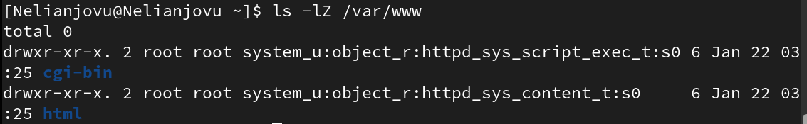{#fig:001 width=70%}

## Выполнение лабораторной работы

В директории /var/www/html нет файлов(рис.7)

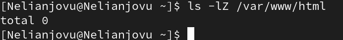{#fig:001 width=70%}

## Выполнение лабораторной работы

Только суперпользователь может создать файл, поэтому я создала файл с помощью команды touch.html и ввела в него код(рис.8 и рис.9)

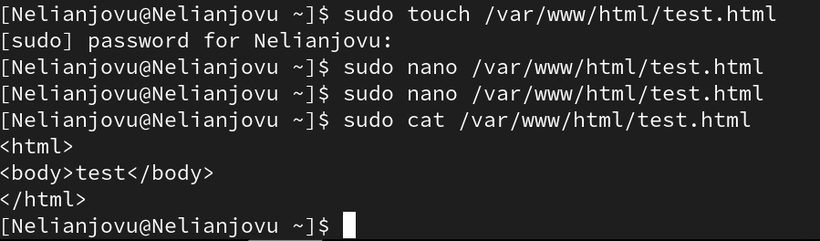{#fig:001 width=70%}

## Выполнение лабораторной работы

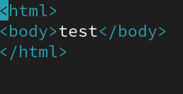{#fig:001 width=70%}

## Выполнение лабораторной работы

Я проверяю контекст созданного файла. По умолчанию это httpd_sys_content_type(рис.10)

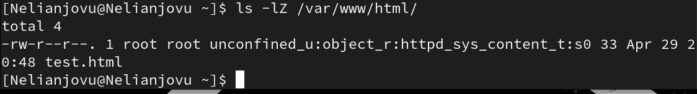{#fig:001 width=70%}

## Выполнение лабораторной работы

Я получаю доступ к файлу через веб-сервер, вводя адрес в браузере http://127.0.0.1/test.html . Файл был успешно отображен(рис.11)

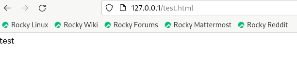{#fig:001 width=70%}

## Выполнение лабораторной работы

Я изучила справку man по httpd-selinux(рис.12)

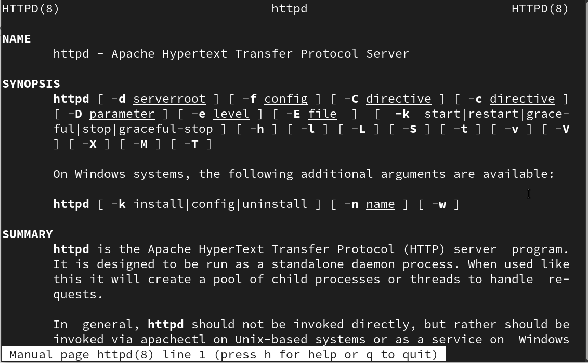{#fig:001 width=70%}

## Выполнение лабораторной работы

I change the context of the file /var/www/html/test.html from httpd_sys_content_t to any other that the httpd process should not have access to, for example, to samba_share_t: chcon -t samba_share_t /var/www/html/test.html css/var/www/html/test.html The context has really changed(рис.13)

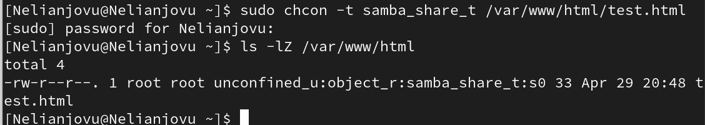{#fig:001 width=70%}

## Выполнение лабораторной работы

Когда я пытаюсь отобразить файл в браузере, мы получаем сообщение об ошибке(рис.14)

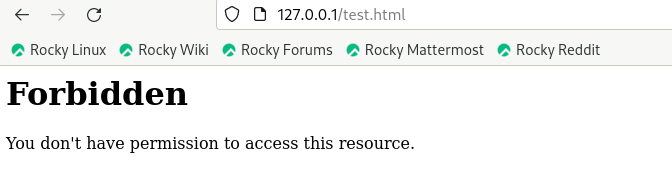{#fig:001 width=70%}

## Выполнение лабораторной работы

Я просматриваю файлы журнала веб-сервера Apache и файл системного журнала: tail /var/log/messages. Если в системе запущены процессы setroubleshootd и audit, вы также можете увидеть ошибки, аналогичные перечисленным выше, в файле /var/log/audit/audit.log(рис.15)

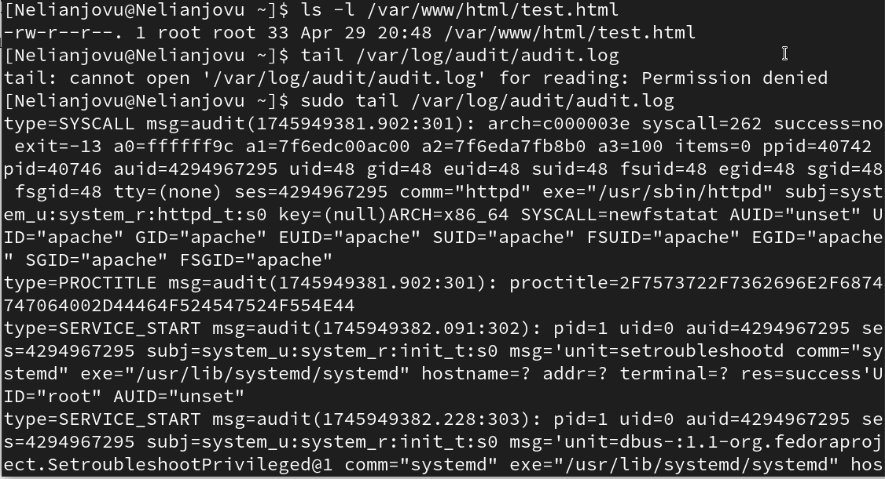{#fig:001 width=70%}

## Выполнение лабораторной работы

Чтобы запустить веб-сервер Apache, прослушивающий TCP-порт 81, я открываю файл /etc/httpd/httpd.conf для внесения изменений(рис.16)

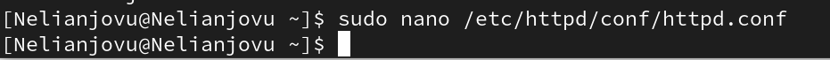{#fig:001 width=70%}

## Выполнение лабораторной работы

Нахожу строчку Listen 80 и заменяю её на Listen 81(рис.17)

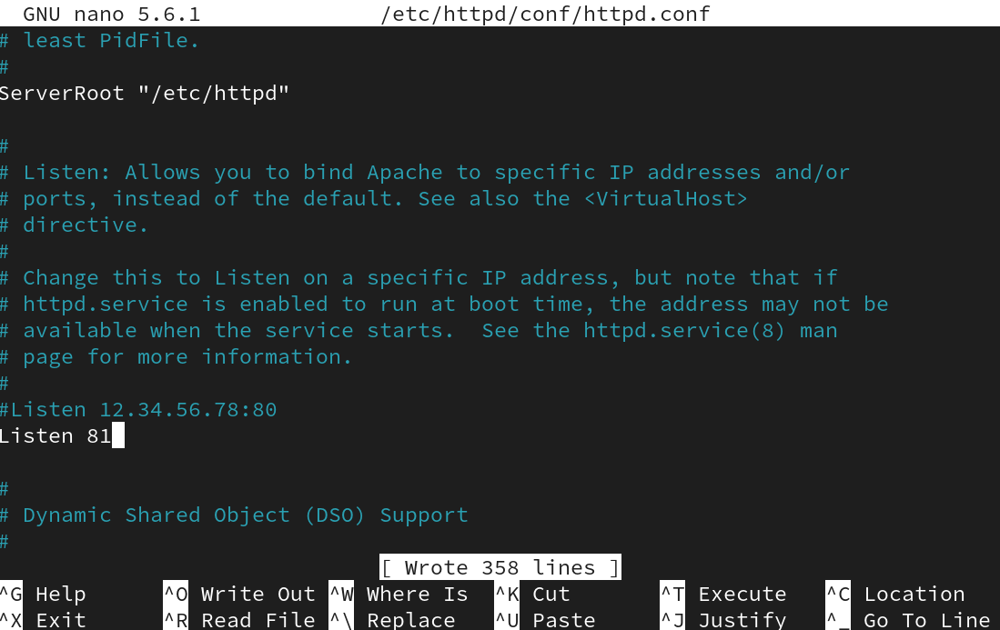{#fig:001 width=70%}

## Выполнение лабораторной работы

Я перезапускаю веб-сервер Apache. Сбой произошел из-за того, что порт 80 предназначен для локальной сети, а порт 81 - нет(рис.18)

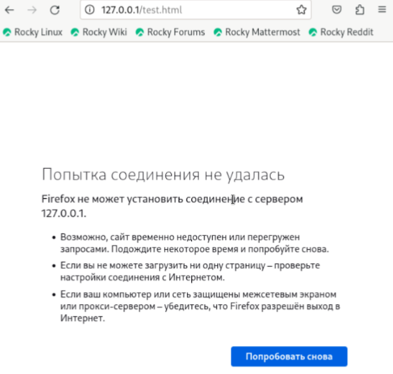{#fig:001 width=70%}

## Выполнение лабораторной работы

Проанализируйте лог-файлы: tail -nl /var/log/messages(рис.19)

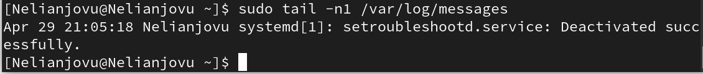{#fig:001 width=70%}

## Выполнение лабораторной работы

Я просматриваю файлы /var/log/http/error_log, /var/log/httpd access_log и /var/log/audit/аудит.лог и выясняю, в каких файлах появились записи. Запись появилась в файле error_log(рис.20)

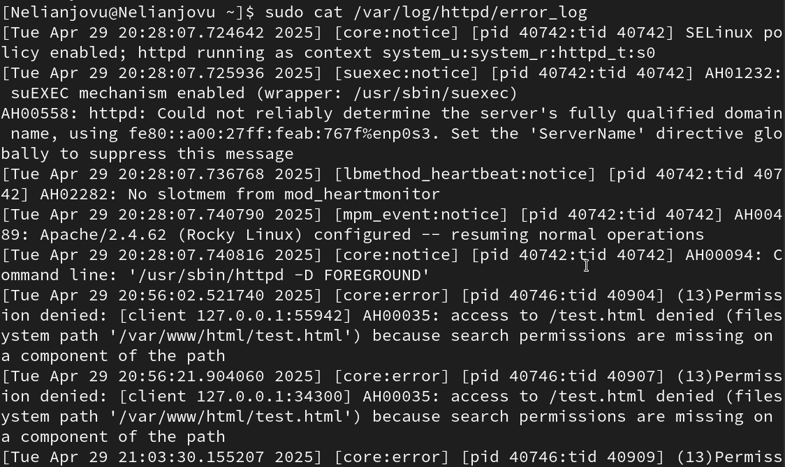{#fig:001 width=70%}

## Выполнение лабораторной работы

Я запускаю команду semanage port -at http_port_to tcp 81, после чего проверяю список портов командой semanage port -l | grep http_port_t Порт 81 появился в списке(рис.21)

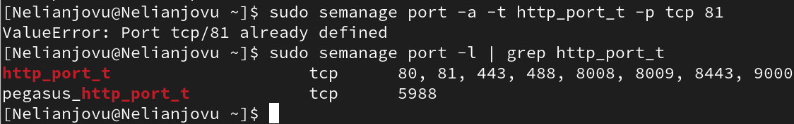{#fig:001 width=70%}

## Выполнение лабораторной работы

Перезапускаю сервер Apache(рис.22)

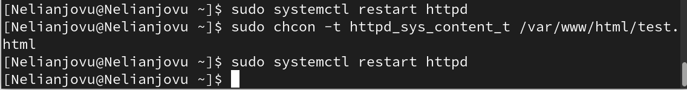{#fig:001 width=70%}

## Выполнение лабораторной работы

Теперь он работает, ведь мы внесли порт 81 в список портов httpd_port_t(рис.23)

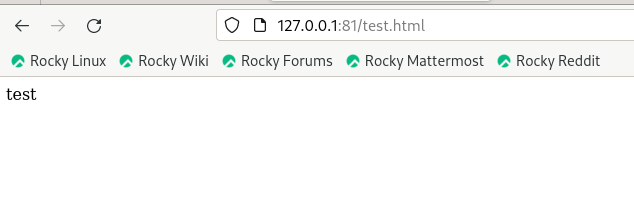{#fig:001 width=70%}

## Выполнение лабораторной работы

Возвращаю в файле /etc/httpd/httpd.conf порт 80, вместо 81. Проверяю, что порт 81 удален, это правда(рис.24)

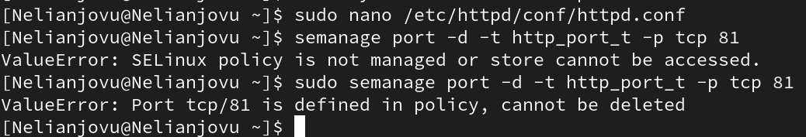{#fig:001 width=70%}

## Выполнение лабораторной работы

Далее удаляю файл test.html, проверяю, что он удален(рис.25)

{#fig:001 width=70%}

## Выводы

В ходе выполнения данной лабораторной работы были развиты навыки администрирования ОС Linux, получено первое практическое знакомство с технологией SELinux и проверена работа SELinux на практике совместно с веб-сервером Apache
