---
## Front matter
title: "Отчёт по лабораторной работе 6"
subtitle: "Основы информационной безопасности"
author: "Нджову Нелиа"

## Generic otions
lang: ru-RU
toc-title: "Содержание"

## Bibliography
bibliography: bib/cite.bib
csl: pandoc/csl/gost-r-7-0-5-2008-numeric.csl

## Pdf output format
toc: true # Table of contents
toc-depth: 2
lof: true # List of figures
lot: true # List of tables
fontsize: 12pt
linestretch: 1.5
papersize: a4
documentclass: scrreprt
## I18n polyglossia
polyglossia-lang:
  name: russian
  options:
	- spelling=modern
	- babelshorthands=true
polyglossia-otherlangs:
  name: english
## I18n babel
babel-lang: russian
babel-otherlangs: english
## Fonts
mainfont: PT Serif
romanfont: PT Serif
sansfont: PT Sans
monofont: PT Mono
mainfontoptions: Ligatures=TeX
romanfontoptions: Ligatures=TeX
sansfontoptions: Ligatures=TeX,Scale=MatchLowercase
monofontoptions: Scale=MatchLowercase,Scale=0.9
## Biblatex
biblatex: true
biblio-style: "gost-numeric"
biblatexoptions:
  - parentracker=true
  - backend=biber
  - hyperref=auto
  - language=auto
  - autolang=other*
  - citestyle=gost-numeric
## Pandoc-crossref LaTeX customization
figureTitle: "Рис."
tableTitle: "Таблица"
listingTitle: "Листинг"
lofTitle: "Список иллюстраций"
lotTitle: "Список таблиц"
lolTitle: "Листинги"
## Misc options
indent: true
header-includes:
  - \usepackage{indentfirst}
  - \usepackage{float} # keep figures where there are in the text
  - \floatplacement{figure}{H} # keep figures where there are in the text
---

# Цель работы

Развить навыки администрирования ОС Linux. Получить первое практическое знакомство с технологией SELinux1. Проверить работу SELinux на практике совместно с веб-сервером Apache.

# Выполнение лабораторной работы

Я вошла в свою учетную запись и убедилась, что SELinux работает в режиме принудительного применения целевой политики, используя команды getenforce и status(рис.1)

{#fig:001 width=70%}

Я запускаю сервер apache, затем использую браузер для доступа к веб-серверу, запущенному на компьютере, он запущен, как видно из вывода команды service httpd status(рис.2)

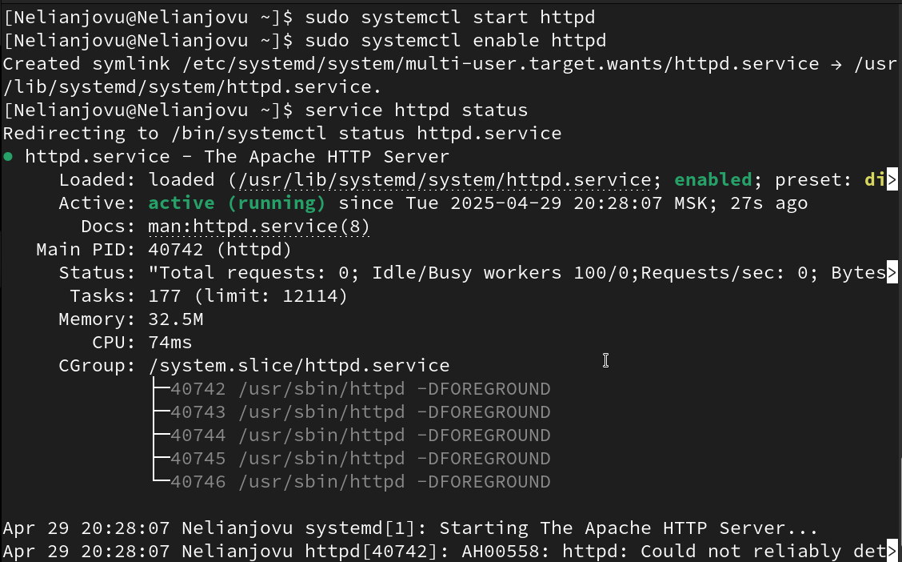{#fig:001 width=70%}

Я нашла веб-сервер Apache в списке процессов, используя команду ps aux | grep httpd. Его контекст безопасности - http_t(рис.3)

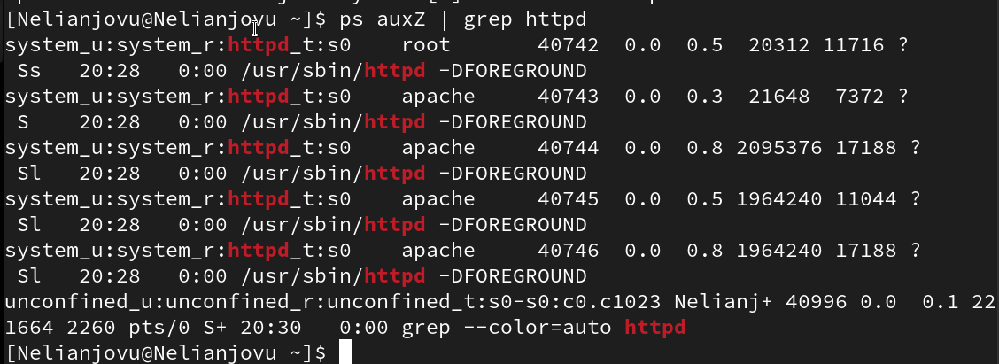{#fig:001 width=70%}

Я просмотрела текущее состояние коммутаторов SELinux для Apache, используя команду status -grep httpd(рис.4)

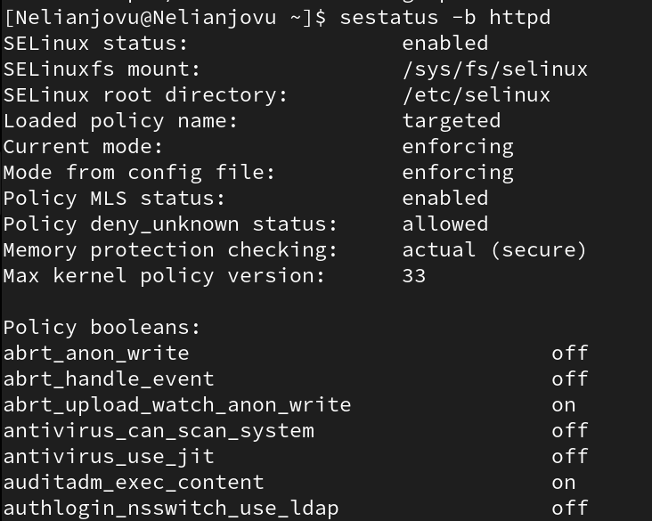{#fig:001 width=70%}

Я просмотрела статистику по политике, используя команду setinfo. Всего 8 пользователей, 39 ролей и 5135 типов(рис.5)

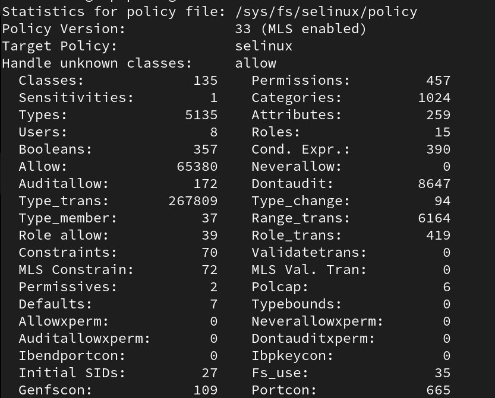{#fig:001 width=70%}

Типы подкаталогов, расположенных в каталоге /var/www с помощью команды ls - lZ /var/www, следующие: владельцем является root, только у владельца есть права на изменение. В каталоге нет файлов(рис.6)

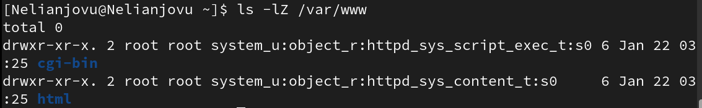{#fig:001 width=70%}

В директории /var/www/html нет файлов(рис.7)

{#fig:001 width=70%}

Только суперпользователь может создать файл, поэтому я создала файл с помощью команды touch.html и ввела в него код(рис.8 и рис.9)

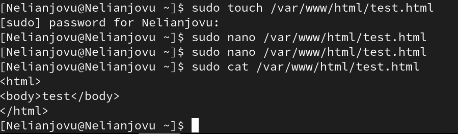{#fig:001 width=70%}

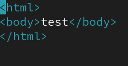{#fig:001 width=70%}

Я проверяю контекст созданного файла. По умолчанию это httpd_sys_content_type(рис.10)

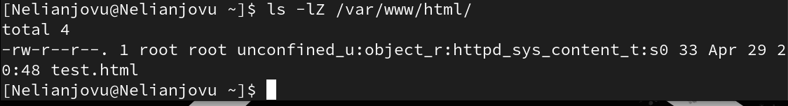{#fig:001 width=70%}

Я получаю доступ к файлу через веб-сервер, вводя адрес в браузере http://127.0.0.1/test.html . Файл был успешно отображен(рис.11)

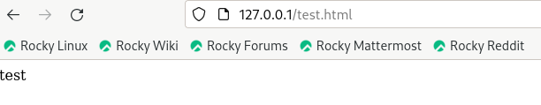{#fig:001 width=70%}

Я изучил справку man по httpd-selinux. Давайте рассмотрим полученный контекст подробнее. Поскольку по умолчанию пользователи CentOS не имеют доступа к типам, созданный нами файл test.html SELinux был сопоставлен, пользователь unconfined-u. Это первая часть контекста. Кроме того, политика совместного использования ролей RBAC используется процессами, но не файлами, поэтому роли не имеют значения для файлов. Роль object-r используется по умолчанию для файлов на "постоянных" носителях и в сетевых файловых системах. Тип httpd_sys_content_t позволяет процессу httpd получить доступ к файлу. Благодаря наличию последнего типа мы получили доступ к файлу при обращении к нему через браузер(рис.12)

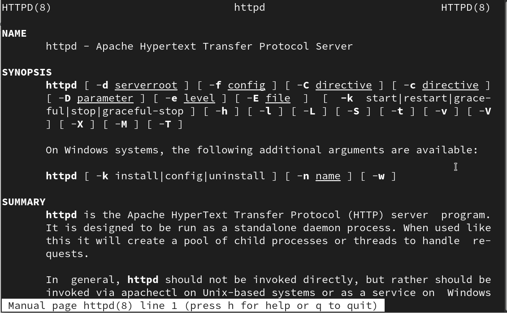{#fig:001 width=70%}

I change the context of the file /var/www/html/test.html from httpd_sys_content_t to any other that the httpd process should not have access to, for example, to samba_share_t: chcon -t samba_share_t /var/www/html/test.html css/var/www/html/test.html The context has really changed(рис.13)

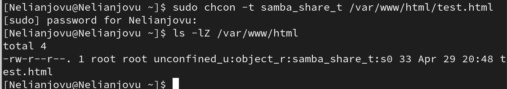{#fig:001 width=70%}

Когда я пытаюсь отобразить файл в браузере, мы получаем сообщение об ошибке(рис.14)

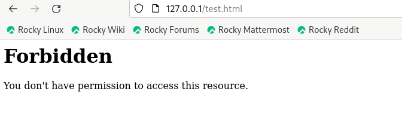{#fig:001 width=70%}

Файл не был отображен, хотя права доступа позволяют любому пользователю читать этот файл, поскольку был задан контекст, к которому процесс httpd не должен иметь доступа. Я просматриваю файлы журнала веб-сервера Apache и файл системного журнала: tail /var/log/messages. Если в системе запущены процессы setroubleshootd и audit, вы также можете увидеть ошибки, аналогичные перечисленным выше, в файле /var/log/audit/audit.log(рис.15)

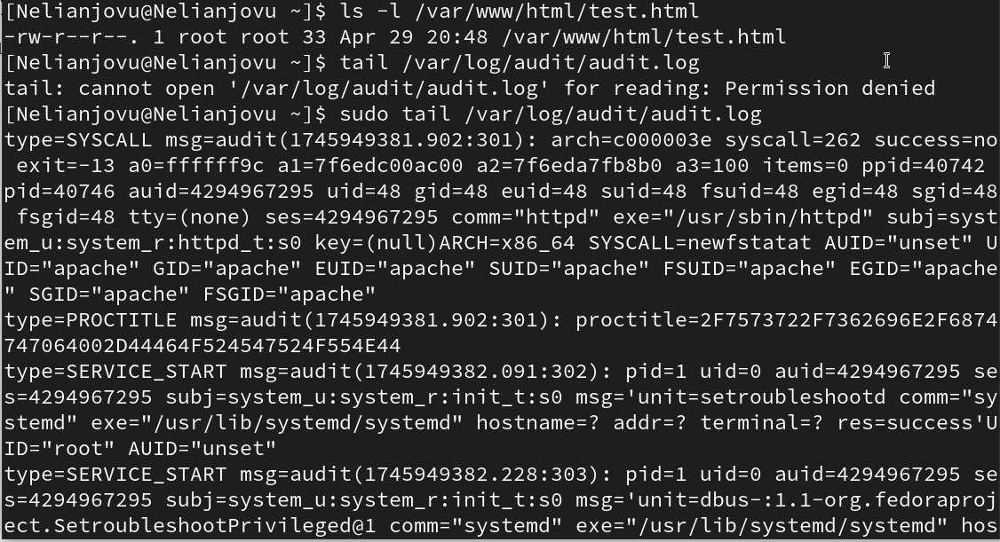{#fig:001 width=70%}

Чтобы запустить веб-сервер Apache, прослушивающий TCP-порт 81, я открываю файл /etc/httpd/httpd.conf для внесения изменений(рис.16)

{#fig:001 width=70%}

Нахожу строчку Listen 80 и заменяю её на Listen 81(рис.17)

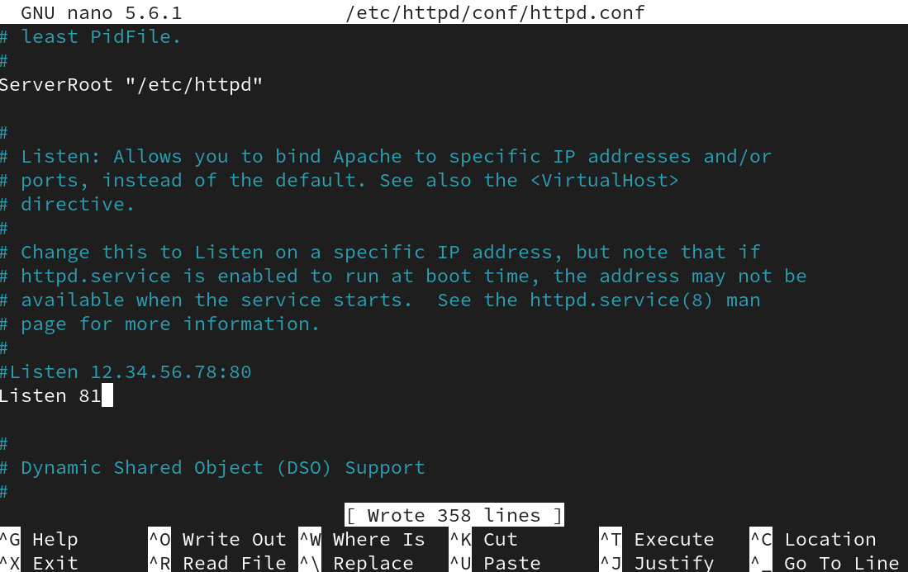{#fig:001 width=70%}

Я перезапускаю веб-сервер Apache. Сбой произошел из-за того, что порт 80 предназначен для локальной сети, а порт 81 - нет(рис.18)

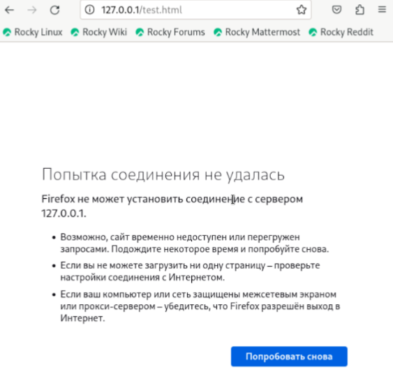{#fig:001 width=70%}

Проанализируйте лог-файлы: tail -nl /var/log/messages(рис.19)

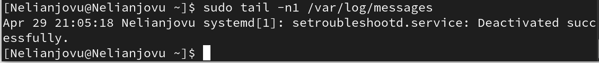{#fig:001 width=70%}

Я просматриваю файлы /var/log/http/error_log, /var/log/httpd access_log и /var/log/audit/аудит.лог и выясняю, в каких файлах появились записи. Запись появилась в файле error_log(рис.20)

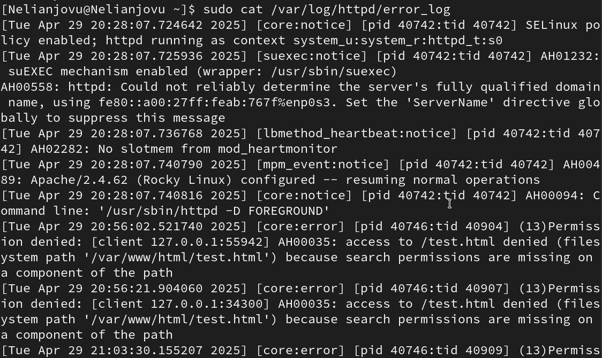{#fig:001 width=70%}

Я запускаю команду semanage port -at http_port_to tcp 81, после чего проверяю список портов командой semanage port -l | grep http_port_t Порт 81 появился в списке(рис.21)

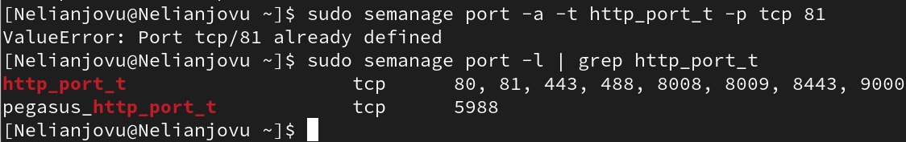{#fig:001 width=70%}

Перезапускаю сервер Apache(рис.22)

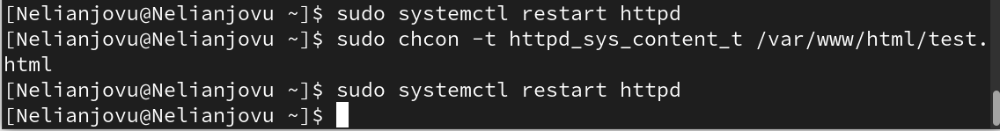{#fig:001 width=70%}

Теперь он работает, ведь мы внесли порт 81 в список портов httpd_port_t(рис.23)

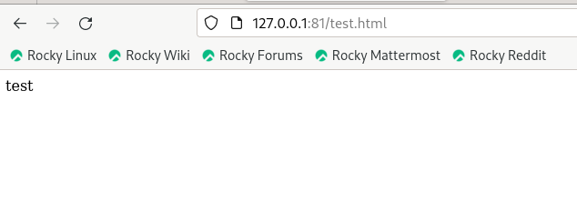{#fig:001 width=70%}

Возвращаю в файле /etc/httpd/httpd.conf порт 80, вместо 81. Проверяю, что порт 81 удален, это правда(рис.24)

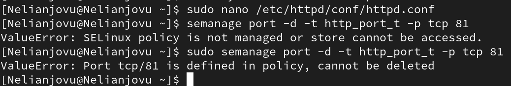{#fig:001 width=70%}

Далее удаляю файл test.html, проверяю, что он удален(рис.25)

{#fig:001 width=70%}

# Выводы

В ходе выполнения данной лабораторной работы были развиты навыки администрирования ОС Linux, получено первое практическое знакомство с технологией SELinux и проверена работа SELinux на практике совместно с веб-сервером Apache

# Список литературы{.unnumbered}

006-lab_selinux.pdf
