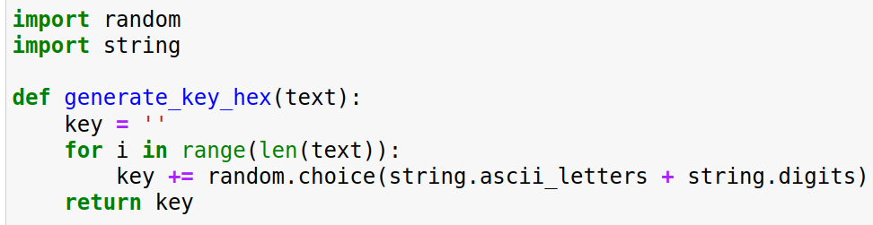
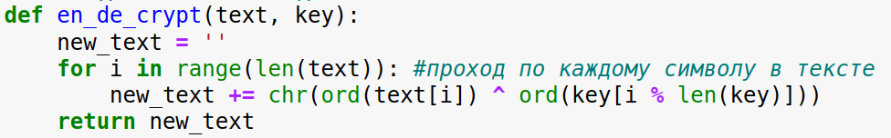
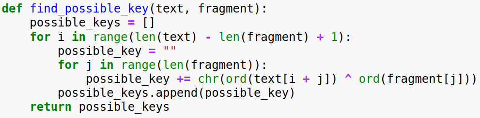
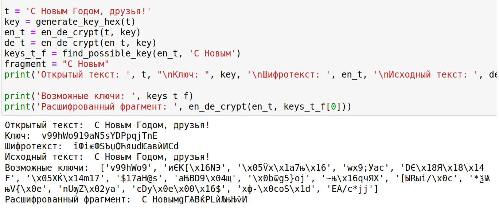

---
## Front matter
lang: ru-RU
title: Презентация по лабораторной работе 7
subtitle: Основы информационной безопасности
author:
  - Нджову Нелиа.
institute:
  - Российский университет дружбы народов, Москва, Россия
date: 16 мая 2025

## i18n babel
babel-lang: russian
babel-otherlangs: english

## Formatting pdf
toc: false
toc-title: Содержание
slide_level: 2
aspectratio: 169
section-titles: true
theme: metropolis
header-includes:
 - \metroset{progressbar=frametitle,sectionpage=progressbar,numbering=fraction}
 - '\makeatletter'
 - '\beamer@ignorenonframefalse'
 - '\makeatother'
---

## Цель работы

Освоить на практике применение режима однократного гаммирования

## Задание

Нужно подобрать ключ, чтобы получить сообщение «С Новым Годом, друзья!». Требуется разработать приложение, позволяющее шифровать и дешифровать данные в режиме однократного гаммирования. Приложение должно:

1. Определить вид шифротекста при известном ключе и известном открытом тексте.

2. Определить ключ, с помощью которого шифротекст может быть преобразован в некоторый фрагмент текста, представляющий собой один из возможных вариантов прочтения открытого текста

## Теоретическое введение

**Гаммирование (схема Вернама)** — это надёжный и простой способ шифрования. Он основан на **однократном наложении** специальной последовательности (называемой **гаммой**) на открытые данные. Это наложение выполняется с помощью операции **XOR (по модулю 2)** между каждым символом открытого текста и соответствующим символом гаммы (ключа).

## Выполнение лабораторной работы

Я выполнала лабораторную работа на языке программирования Python, листинг программы и результаты выполнения приведены в отчете.

Требуется разработать программу, позволяющее шифровать и дешифровать данные в режиме однократного гаммирования. Начнем с создания функции для генерации случайного ключа(рис.1).

{#fig:001 width=70%}

## Выполнение лабораторной работы

Необходимо определить вид шифротекста при известном ключе и известном открытом тексте. Так как операция исключающего или отменяет сама себя, делаю одну функцю и для шифрования и для дешифрования текста(рис.2).

{#fig:002 width=70%}

## Выполнение лабораторной работы

Нужно определить ключ, с помощью которого шифротекст может быть преобразован в некоторый фрагмент текста, представляющий собой один из возможных вариантов прочтения открытого текста. Для этого создаю функцию для нахождения возможных ключей для фрагмента текста(рис.3). 

{#fig:003 width=70%}

## Выполнение лабораторной работы

Проверка работы всех функций. Шифрование и дешифрование происходит верно, как и нахождение ключей, с помощью которых можно расшифровать верно только кусок текста(рис.4).

{#fig:004 width=70%}

## Выполнение лабораторной работы

Листинг программы 1:

```python

import random
import string

def generate_key_hex(text):
    key = ''
    for i in range(len(text)):
        key += random.choice(string.ascii_letters + string.digits) 
    return key
```
## Выполнение лабораторной работы

```
def en_de_crypt(text, key):
    new_text = ''
    for i in range(len(text)): #проход по каждому символу в тексте
        new_text += chr(ord(text[i]) ^ ord(key[i % len(key)]))
    return new_text
```

## Выполнение лабораторной работы

```
def find_possible_key(text, fragment):
    possible_keys = []
    for i in range(len(text) - len(fragment) + 1):
        possible_key = ""
        for j in range(len(fragment)):
            possible_key += chr(ord(text[i + j]) ^ ord(fragment[j]))
        possible_keys.append(possible_key)
    return possible_keys
```

## Выполнение лабораторной работы

```
t = 'С Новым Годом, друзья!'
key = generate_key_hex(t)
en_t = en_de_crypt(t, key)
de_t = en_de_crypt(en_t, key)
keys_t_f = find_possible_key(en_t, 'С Новым')
fragment = "С Новым"
print('Открытый текст: ', t, "\nКлюч: ", key, '\nШифротекст: ', en_t, '\nИсходный текст: ', de_t,)

print('Возможные ключи: ', keys_t_f)
print('Расшифрованный фрагмент: ', en_de_crypt(en_t, keys_t_f[0]))
```

## Выводы

В ходе выполнения данной лабораторной работы мной было освоено на практике применение режима однократного гаммирования.

