---
## Front matter
title: "Отчёт по индивидуальнной прокте: Этап 2"
subtitle: "Основы информационной безопасноти"
author: "Нджову Нелиа"

## Generic otions
lang: ru-RU
toc-title: "Содержание"

## Bibliography
bibliography: bib/cite.bib
csl: pandoc/csl/gost-r-7-0-5-2008-numeric.csl

## Pdf output format
toc: true # Table of contents
toc-depth: 2
lof: true # List of figures
lot: true # List of tables
fontsize: 12pt
linestretch: 1.5
papersize: a4
documentclass: scrreprt
## I18n polyglossia
polyglossia-lang:
  name: russian
  options:
	- spelling=modern
	- babelshorthands=true
polyglossia-otherlangs:
  name: english
## I18n babel
babel-lang: russian
babel-otherlangs: english
## Fonts
mainfont: PT Serif
romanfont: PT Serif
sansfont: PT Sans
monofont: PT Mono
mainfontoptions: Ligatures=TeX
romanfontoptions: Ligatures=TeX
sansfontoptions: Ligatures=TeX,Scale=MatchLowercase
monofontoptions: Scale=MatchLowercase,Scale=0.9
## Biblatex
biblatex: true
biblio-style: "gost-numeric"
biblatexoptions:
  - parentracker=true
  - backend=biber
  - hyperref=auto
  - language=auto
  - autolang=other*
  - citestyle=gost-numeric
## Pandoc-crossref LaTeX customization
figureTitle: "Рис."
tableTitle: "Таблица"
listingTitle: "Листинг"
lofTitle: "Список иллюстраций"
lotTitle: "Список таблиц"
lolTitle: "Листинги"
## Misc options
indent: true
header-includes:
  - \usepackage{indentfirst}
  - \usepackage{float} # keep figures where there are in the text
  - \floatplacement{figure}{H} # keep figures where there are in the text
---

# Цель работы

Приобретение практических навыков по установке DVWA.

# Задание

1. Установите DVWA на дистрибутив Kali Linux

# Выполнение лабораторной работы

Поскольку я буду настраивать DVWA на моем локальном хостинге, я откываю терминал и перехожу в каталог /var/www/html. Затем я клонирую репозиторий DVWA на github в каталог /html, используя команду git clone(рис.1).

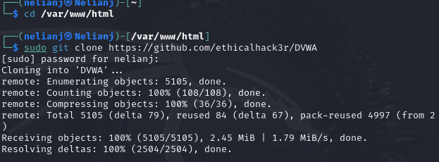{#fig:001 width=70%}

После этого, я запускаю команду ls, чтобы подвердить, что DVWA был успешно клонирован. После подверждения я меняю права доступа к файла DVWA(рис.2)

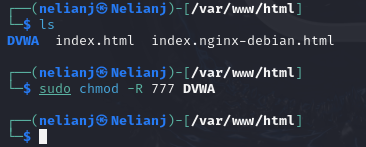{#fig:001 width=70%}

Чтобы настроить DVWA, нужно перейти в каталог /dvwa/config, затем проверяю содержимое каталога(рис.3)

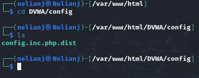{#fig:001 width=70%}

Я делаю копию файла config.inc.php.dist, называю его config.inc.php. Я использую новый файл для настройки DVWA.Файл config.inc.php.dist не изменяем его, чтобы у нас будет запасной вариант, если что-то пойдет не так(рис.4)

{#fig:001 width=70%}

Теперь я открываю файл config.inc.php с помощью редактора nano, чтобы выполнить необходимые настройки(рис.5)

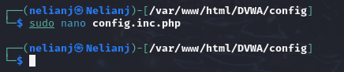{#fig:001 width=70%}

Я изменяю данные об имени пользователя и пароле(рис.6)

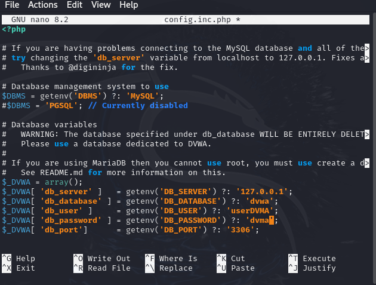{#fig:001 width=70%}

По умолчанию Kali Linux поставляется с установленным Система управления реляционными базами данных MariaDB. Поэтому мне не нужно устанавливать никаких пакетов, я просто запускаю службу mysql командой sudo systemctl start mysql(рис.7)

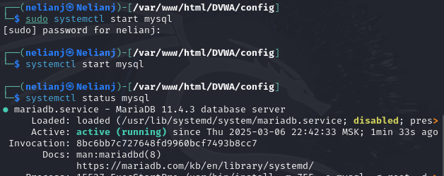{#fig:001 width=70%}

Я вхожу в базу данных, используя команду sudo mysql -u root -p. В этом случае я использую root, так как это имя суперпользователя, установленное в моей системе. Затем я создаю нового пользователя, используя учетные данные, которые я установил в файле config.inc.php(рис.8)

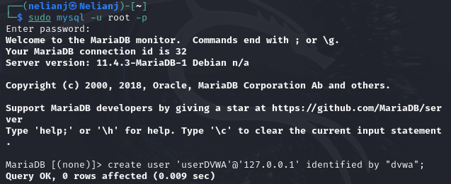{#fig:001 width=70%}

Теперь я предоставляю этому пользователю полные привилегии над базой данных dvwa(рис.9)

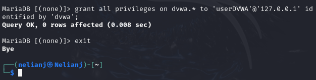{#fig:001 width=70%}

Необходимо настроить сервер apache2, перехожу в соответствующую директорию(рис.10)

{#fig:001 width=70%}

В моем текущем каталоге я открываю файл php.ini с помощью текстового редактора(nano), чтобы редактировать его(рис.11)

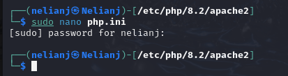{#fig:001 width=70%}

Я прокручиваю страницу вниз, ищу строки allow_url_fopen и allow_url_include и убеждаюсь, что обе они включены(рис.12)

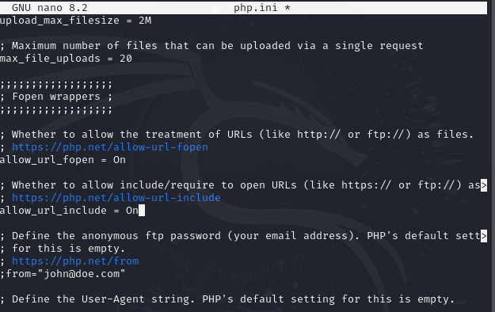{#fig:001 width=70%}

Я запускаю службу веб-сервера apache и проверяю, запущена ли служба (рис.13)

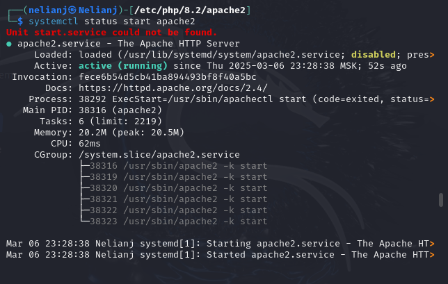{#fig:001 width=70%}

Я настроила DVWA, Apache и базу данных, поэтому открываю браузер и запускаю веб-приложение, введя 127.0.0/DVWA(рис.14)

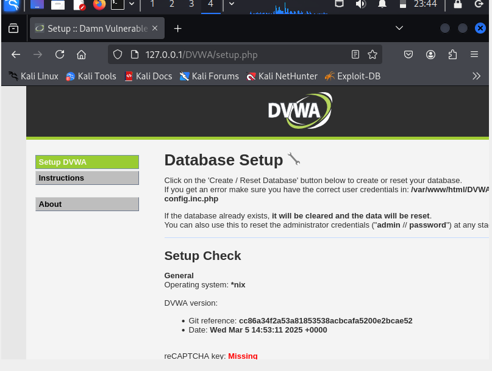{#fig:001 width=70%}

Я прокручиваю страницу вниз и нажимаю на кнопку create\reset database(рис.15)

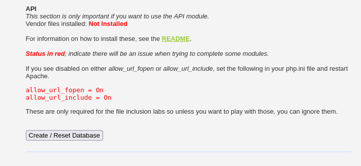{#fig:001 width=70%}

Я авторизуюсь с помощью предложенных по умолчанию данных(рис.16)

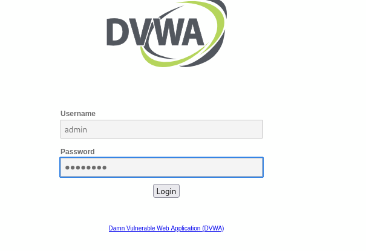{#fig:001 width=70%}

Я оказываюсь на домшней странице веб-приложения, на этом установка окончена(рис.17)

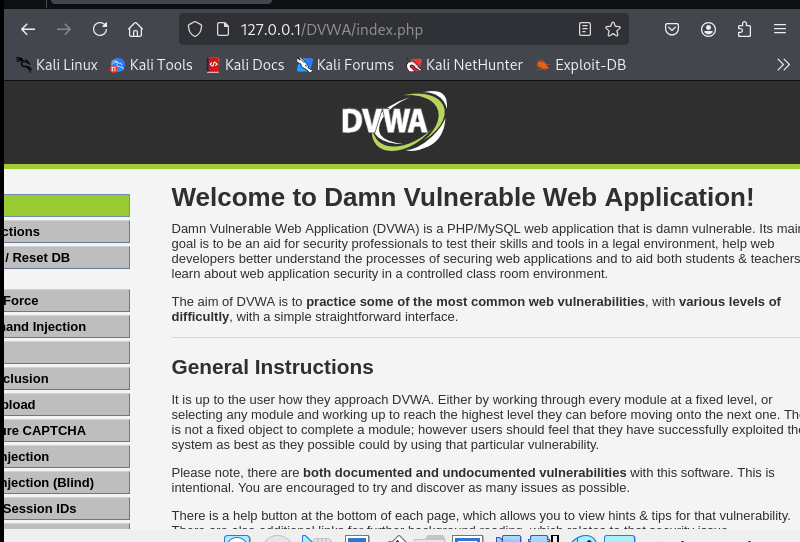{#fig:001 width=70%}

# Выводы

Выполнив эту работе, я приобрела практических навыков по установке уязвимого веб-приложения DVWA.

# Список литературы{.unnumbered}

https://nooblinux.com/how-to-install-dvwa/
