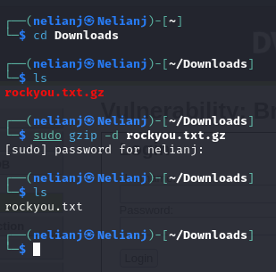
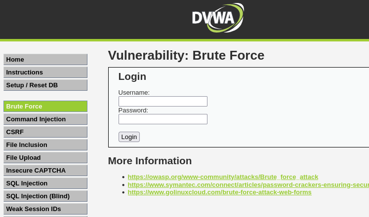
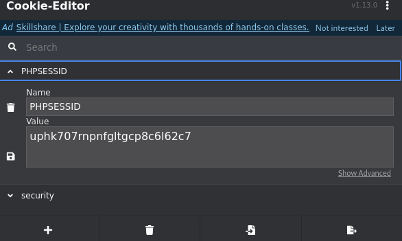
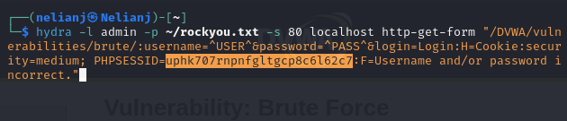
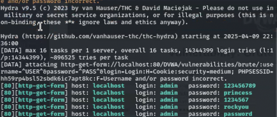
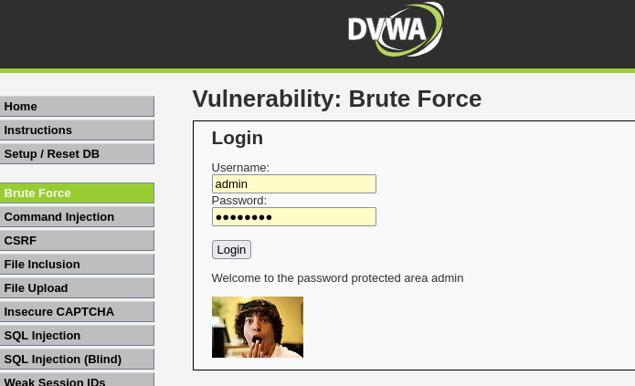

---
## Front matter
lang: ru-RU
title: Презентация по индивидуальной проекте этап 3
subtitle: Основной информационной системе
author:
  - Нджову Н.
institute:
  - Российский университет дружбы народов, Москва, Россия
date: 10 апрель 2025

## i18n babel
babel-lang: russian
babel-otherlangs: english

## Formatting pdf
toc: false
toc-title: Содержание
slide_level: 2
aspectratio: 169
section-titles: true
theme: metropolis
header-includes:
 - \metroset{progressbar=frametitle,sectionpage=progressbar,numbering=fraction}
 - '\makeatletter'
 - '\beamer@ignorenonframefalse'
 - '\makeatother'
---

## Цель работы

Приобретение практических навыков по использованию инструмента Hydra для брутфорса паролей.

## Задание

1. Реаловать эксплуатацию нязвимости с помощью брутфорса паролей.

## Теоретическое введение

### Переписано и кратко изложено:

**Hydra** — это инструмент для подбора или взлома логинов и паролей. Он поддерживает множество протоколов и сервисов.

#### Команда Hydra:

```bash
hydra -l root -P ~/pass_lists/dedik_passes.txt -o ./hydra_result.log -f -V -s 80 178.72.90.181 http-post-form "/cgi-bin/luci:username=^USER^&password=^PASS^:Invalid username"
```
## Выполнение лабораторной работы

Чтобы ввести пробрутфорсить пароль, вам сначала нужно найти большой список часто используемых паролей. Стандартный список rockyou.txt уже был в моем kali linux, поэтому я скопировала его в каталог загрузок и извлек.(рис.1).

{#fig:001 width=70%}

## Выполнение лабораторной работы

Я захожу на сайт DVWA, полученный в ходе предыдущего этапа проекта. Для запроса hydra мне понадобятся параметры cookie с этого сайта(рис.2)

{#fig:001 width=70%}

## Выполнение лабораторной работы

Чтобы получить информацию о параметрах cookie, необходимо расширение для браузера(cookie editor). Итак, я установила его и скопировала параметры cookie с его помощью(рис.3)

{#fig:001 width=70%}

## Выполнение лабораторной работы

Я ввожу необходимую информацию в запрос Hydra. Мы подберем пароль для пользователя admin, используя запрос GET с двумя параметрами cookie: security и PHPSESSID, которые указаны в последнем абзаце(рис.4)

{#fig:001 width=70%}

## Выполнение лабораторной работы

Через некоторое время я получил список подходящих паролей(рис.5)

{#fig:001 width=70%}

## Выполнение лабораторной работы

Я ввожу полученные данные на сайте для проверки и получаю положительный результат проверки пароля.

{#fig:001 width=70%}

## Выводы

Выполнив эту работу, я приобрела практические навыки по использованию инструмента Hydra для брутфорса паролей.
