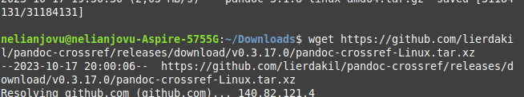

---
## Front matter
title: "Отчёта по индивидуальной проекте этап 3"
subtitle: "Основной информационной системе"
author: "Нджову Нелиа"

## Generic otions
lang: ru-RU
toc-title: "Содержание"

## Bibliography
bibliography: bib/cite.bib
csl: pandoc/csl/gost-r-7-0-5-2008-numeric.csl

## Pdf output format
toc: true # Table of contents
toc-depth: 2
lof: true # List of figures
lot: true # List of tables
fontsize: 12pt
linestretch: 1.5
papersize: a4
documentclass: scrreprt
## I18n polyglossia
polyglossia-lang:
  name: russian
  options:
	- spelling=modern
	- babelshorthands=true
polyglossia-otherlangs:
  name: english
## I18n babel
babel-lang: russian
babel-otherlangs: english
## Fonts
mainfont: PT Serif
romanfont: PT Serif
sansfont: PT Sans
monofont: PT Mono
mainfontoptions: Ligatures=TeX
romanfontoptions: Ligatures=TeX
sansfontoptions: Ligatures=TeX,Scale=MatchLowercase
monofontoptions: Scale=MatchLowercase,Scale=0.9
## Biblatex
biblatex: true
biblio-style: "gost-numeric"
biblatexoptions:
  - parentracker=true
  - backend=biber
  - hyperref=auto
  - language=auto
  - autolang=other*
  - citestyle=gost-numeric
## Pandoc-crossref LaTeX customization
figureTitle: "Рис."
tableTitle: "Таблица"
listingTitle: "Листинг"
lofTitle: "Список иллюстраций"
lotTitle: "Список таблиц"
lolTitle: "Листинги"
## Misc options
indent: true
header-includes:
  - \usepackage{indentfirst}
  - \usepackage{float} # keep figures where there are in the text
  - \floatplacement{figure}{H} # keep figures where there are in the text
---

# Цель работы

Приобретение практических навыков по использованию инструмента Hydra для брутфорса паролей.

# Задание

1. Реаловать эксплуатацию нязвимости с помощью брутфорса паролей.

# Теоретическое введение

### Переписано и кратко изложено:

**Hydra** — это инструмент для подбора или взлома логинов и паролей. Он поддерживает множество протоколов и сервисов.

#### Пример использования:
- **IP сервера**: `178.72.90.181`
- **Сервис**: HTTP на порту `80`
- **Авторизация**: через HTML-форму, отправляющую POST-запрос на
  `http://178.72.90.181/cgi-bin/luci`
- **Формат запроса**:
  `username=root&password=test_password`
- **Ответ при ошибке входа**:
  `Invalid username and/or password! Please try again.`

#### Команда Hydra:
```bash
hydra -l root -P ~/pass_lists/dedik_passes.txt -o ./hydra_result.log -f -V -s 80 178.72.90.181 http-post-form "/cgi-bin/luci:username=^USER^&password=^PASS^:Invalid username"
```

#### Пояснения:
- Используется модуль `http-post-form`, так как авторизация осуществляется через POST-запрос.
- После модуля указывается:
  1. Путь к скрипту: `/cgi-bin/luci`
  2. Формат POST-запроса с подстановками `^USER^` и `^PASS^`
  3. Сообщение об ошибке при неверных данных: `Invalid username`

Hydra определяет успешную авторизацию по отсутствию этой строки в ответе.

# Выполнение лабораторной работы

Чтобы ввести пробрутфорсить пароль, вам сначала нужно найти большой список часто используемых паролей. Стандартный список rockyou.txt уже был в моем kali linux, поэтому я скопировала его в каталог загрузок и извлек.(рис.1).

{#fig:001 width=70%}

Я захожу на сайт DVWA, полученный в ходе предыдущего этапа проекта. Для запроса hydra мне понадобятся параметры cookie с этого сайта(рис.2)

{#fig:001 width=70%}

Чтобы получить информацию о параметрах cookie, необходимо расширение для браузера(cookie editor). Итак, я установила его и скопировала параметры cookie с его помощью(рис.3)

{#fig:001 width=70%}

Я ввожу необходимую информацию в запрос Hydra. Мы подберем пароль для пользователя admin, используя запрос GET с двумя параметрами cookie: security и PHPSESSID, которые указаны в последнем абзаце(рис.4)

{#fig:001 width=70%}

Через некоторое время я получил список подходящих паролей(рис.5)

{#fig:001 width=70%}

Я ввожу полученные данные на сайте для проверки и получаю положительный результат проверки пароля.

{#fig:001 width=70%}

# Выводы

Выполнив эту работу, я приобрела практические навыки по использованию инструмента Hydra для брутфорса паролей.

# Список литературы{.unnumbered}

https://addons.mozilla.org/en-US/firefox/addon/cookie-editor/?utm_campaign=external-cookie-editor.com

https://github.com/vanhauser-thc/thc-hydra/issues/612
