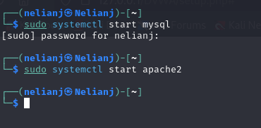
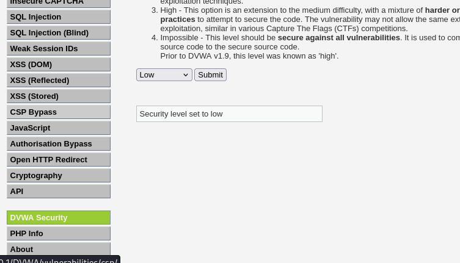
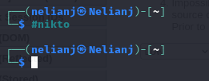
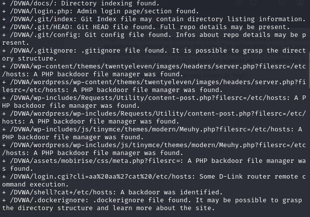
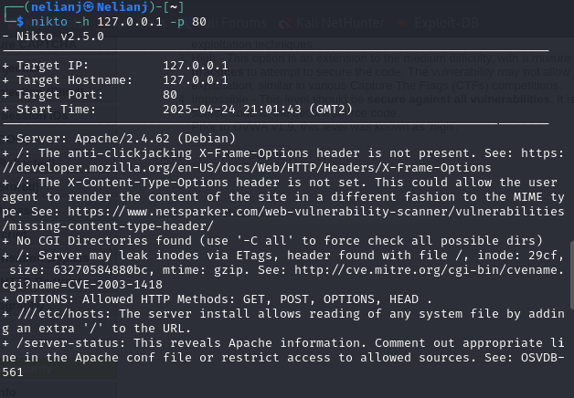
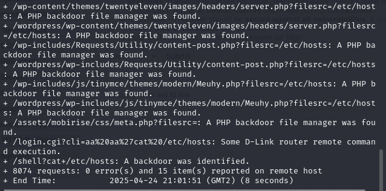

---
## Front matter
lang: ru-RU
title: Презентация по индивидуальнной проекте 4
subtitle: Основы информационной безопасности
author:
  - Нджову Н.
institute:
  - Российский университет дружбы народов, Москва, Россия
date: 26 апрель 2025

## i18n babel
babel-lang: russian
babel-otherlangs: english

## Formatting pdf
toc: false
toc-title: Содержание
slide_level: 2
aspectratio: 169
section-titles: true
theme: metropolis
header-includes:
 - \metroset{progressbar=frametitle,sectionpage=progressbar,numbering=fraction}
 - '\makeatletter'
 - '\beamer@ignorenonframefalse'
 - '\makeatother'
---

## Цель работы

Научиться тестирование веб-приложений с помощью сканер nikto

## Задание

1. Использование nikto

2. Анализ результатов

## Выполнение лабораторной работы

Чтобы работать с nikto(Nikto — это базовый сканер безопасности веб-сервера, который ищет уязвимости, вызванные неправильной конфигурацией, небезопасными файлами и устаревшими приложениями), необходимо подготовить веб-приложение DVWA, которое будем сканировать. Для этого запустила apache2(рис.1)

{#fig:001 width=70%}

## Выполнение лабораторной работы

Я ввхожу в адресной строке браузера адрес DVWA, перехожу в режим выбора уровня безопасности, ставлю минимальный-low(рис.2)

{#fig:001 width=70%}

## Выполнение лабораторной работы

Запускаю nikto(рис.3)

{#fig:001 width=70%}

## Выполнение лабораторной работы

Я проверила веб-приложение, введя его полный URL-адрес и не вводя порт(рис.4 и рис.5)

{#fig:001 width=70%}

## Выполнение лабораторной работы

{#fig:001 width=70%}

## Выполнение лабораторной работы

Затем попробовала просканировать введя адрес хоста и адрес порта, результаты незначительно отличаются(рис.6 и рис.7)

{#fig:001 width=70%}

## Выполнение лабораторной работы

{#fig:001 width=70%}

## Выполнение лабораторной работы

Кроме адреса хоста и порта веб-приложения, никто выводит инофрмацию о различных уязвимостях приложения:

Сервер: Apache/2.4.62 (Debian) + /DVWA/: Заголовок X-Frame-Options, защищающий от перехвата кликов, отсутствует. Смотрите: https://developer.mozilla.org/en-US/docs/Web/HTTP/Headers/X-Frame-Options

• /DVWA/: Заголовок X-Content-Type-Options не задан. Это может позволить пользовательскому агенту отображать содержимое сайта способом, отличным от MIME-типа. Смотрите: https://www.netsparker.com/web-vulnerability-scanner/vulnerabilities/missing-content-type-header/

• Корневая страница /DVWA перенаправляет на: login.php

• Каталоги CGI не найдены (используйте ‘-C all’, чтобы принудительно проверить все возможные каталоги)

## Выполнение лабораторной работы

• ОПЦИИ: Разрешенные HTTP-методы: GET, POST, OPTIONS, HEAD

• /DVWA///etc/hosts: Установка сервера позволяет считывать любой системный файл, добавляя дополнительный “/” к URL-адресу.

• /DVWA/config/: Найдена индексация каталога.

• /DVWA/config/: Информация о конфигурации может быть доступна удаленно

• /DVWA/tests/: Найдена индексация каталога.

• /DVWA/tests/: Это может быть интересно.

## Выполнение лабораторной работы

• /DVWA/database/: Найдена индексация каталога.

• /DVWA/база данных/: Найден каталог базы данных.

• /DVWA/документы/: Найдена индексация каталога.

• /DVWA/login.php: Найдена страница входа администратора/раздел.

• /DVWA/.git/index: Индексный файл Git может содержать информацию о списке каталогов.

## Выполнение лабораторной работы

• /DVWA/.git/HEAD: Найден файл Git HEAD. Может содержаться полная информация о репозитории.

• /DVWA/.git/config: Найден конфигурационный файл Git. Может содержаться информация о деталях репозитория.

• /DVWA/.gitignore: найден файл .gitignore. Можно разобраться в структуре каталогов.

• /DVWA/wp-content/themes/twentyeleven/images/headers/server.php?filesrc=/etc/hosts: Обнаружен файловый менеджер с бэкдором на PHP.

• /DVWA/wordpress/wp-content/themes/twentyeleven/images/headers/server.php?filesrc=/etc Обнаружен файловый менеджер с бэкдором на PHP.

## Выполнение лабораторной работы

• /DVWA/wp-includes/Requests/Utility/content-post.php?filesrc=/etc/hosts: Найден файловый менеджер с бэкдором на PHP.

• /DVWA/wordpress/wp-includes/Requests/Utility/content-post.php?filesrc=/etc/hosts: Найден файловый менеджер с бэкдором на PHP.

• /DVWA/wp-включает в себя/js/tinymce/themes/modern/Meuhy.php?filesrc=/etc/hosts: Найден файловый менеджер бэкдора PHP.

• /DVWA/wordpress/wp-включает в себя/js/tinymce/themes/modern/Meuhy.php?filesrc=/etc/h Найден файловый менеджер бэкдора на PHP.

## Выполнение лабораторной работы

• /DVWA/assets/mobirise/css/meta.php?filesrc=: Найден файловый менеджер бэкдора на PHP.

• /DVWA/login.cgi?cli=aa%20aa%27cat%20/etc/hosts: Удаленное выполнение какой-либо команды маршрутизатором D-Link.

• /DVWA/shell?cat+/etc/hosts: Обнаружен черный ход.

• /DVWA/.dockerignore: найден файл .dockerignore. Возможно, удастся разобраться в структуре каталогов и узнать больше о сайте.

## Выполнение лабораторной работы

Бэкдор, тайный вход (от англ. back door — «чёрный ход», «лазейка», буквально «задняя дверь») — дефект алгоритма, который намеренно встраивается в него разработчиком и позволяет получить несанкционированный доступ к данным или удалённому управлению операционной системой и компьютером в целом.Также в результатах nikto отображает код OSVDB 561 и дает ссылку на CVE-2003-1418. OSVDB — это аббревиатура базы данных уязвимостей с открытым
исходным кодом.

## Выполнение лабораторной работы

CVE-2003-1418 — это уязвимость в Apache HTTP Server 1.3.22–1.3.27 на
OpenBSD, которая позволяет удалённым злоумышленникам получать конфиденциальную информацию через:

• Заголовок ETag, который раскрывает номер вode.

• Многочастную границу MIME, которая раскрывает идентификаторы дочерних процессов (PID).

В настоящее время эта проблема имеет среднюю степень тяжести.

## Выводы

Выполнив эту работу, я научилась тестирование веб-приложений с помощью сканер nikto
