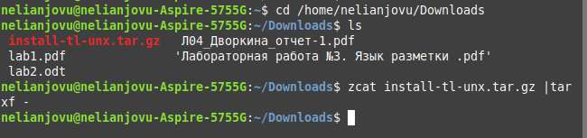
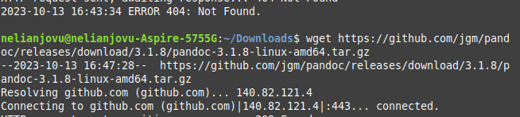
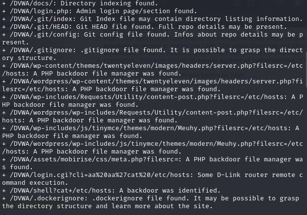
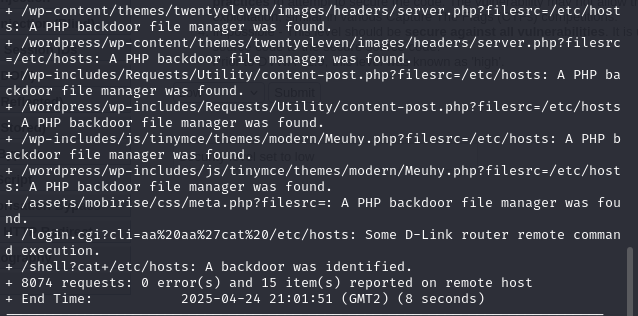

---
## Front matter
title: "Отчёт по индивидуальнной проекте 4 "
subtitle: "Основы информационной безопасности"
author: "Нджову Нелиа"

## Generic otions
lang: ru-RU
toc-title: "Содержание"

## Bibliography
bibliography: bib/cite.bib
csl: pandoc/csl/gost-r-7-0-5-2008-numeric.csl

## Pdf output format
toc: true # Table of contents
toc-depth: 2
lof: true # List of figures
lot: true # List of tables
fontsize: 12pt
linestretch: 1.5
papersize: a4
documentclass: scrreprt
## I18n polyglossia
polyglossia-lang:
  name: russian
  options:
	- spelling=modern
	- babelshorthands=true
polyglossia-otherlangs:
  name: english
## I18n babel
babel-lang: russian
babel-otherlangs: english
## Fonts
mainfont: PT Serif
romanfont: PT Serif
sansfont: PT Sans
monofont: PT Mono
mainfontoptions: Ligatures=TeX
romanfontoptions: Ligatures=TeX
sansfontoptions: Ligatures=TeX,Scale=MatchLowercase
monofontoptions: Scale=MatchLowercase,Scale=0.9
## Biblatex
biblatex: true
biblio-style: "gost-numeric"
biblatexoptions:
  - parentracker=true
  - backend=biber
  - hyperref=auto
  - language=auto
  - autolang=other*
  - citestyle=gost-numeric
## Pandoc-crossref LaTeX customization
figureTitle: "Рис."
tableTitle: "Таблица"
listingTitle: "Листинг"
lofTitle: "Список иллюстраций"
lotTitle: "Список таблиц"
lolTitle: "Листинги"
## Misc options
indent: true
header-includes:
  - \usepackage{indentfirst}
  - \usepackage{float} # keep figures where there are in the text
  - \floatplacement{figure}{H} # keep figures where there are in the text
---

# Цель работы

Научиться тестирование веб-приложений с помощью сканер nikto

# Задание

1. Использование nikto

2. Анализ результатов

# Теоретическое введение

Nikto — это базовый сканер безопасности веб-сервера, который ищет уязвимости, вызванные неправильной конфигурацией, небезопасными файлами и устаревшими приложениями. Построен на LibWhisker2, поддерживает SSL, аутентификацию NTLM/Basic, прокси и методы обхода фильтров. Может проводить тесты на наличие XSS, SQL-инъекций, угадывать пароли словарём и сканировать поддомены.
Запуск: nikto -h <цель> -p <порт>.

Есть параметры настройки тестов (-T), тайм-аутов (-t), формата отчёта (-o, -F), вывода (-D V), угадывания ресурсов (-mutate), обхода фильтров (-evasion) и одиночного теста (-Single).

# Выполнение лабораторной работы

**1. Использование nikto**

Чтобы работать с nikto, необходимо подготовить веб-приложение DVWA, которое будем сканировать. Для этого запустила apache2(рис.1)

{#fig:001 width=70%}

Я ввхожу в адресной строке браузера адрес DVWA, перехожу в режим выбора уровня безопасности, ставлю минимальный-low(рис.2)

{#fig:001 width=70%}

Запускаю nikto(рис.3)

{#fig:001 width=70%}

Я проверила веб-приложение, введя его полный URL-адрес и не вводя порт(рис.4 и рис.5)

{#fig:001 width=70%}

{#fig:001 width=70%}

Затем попробовала просканировать введя адрес хоста и адрес порта, результаты незначительно отличаются(рис.6 и рис.7)

{#fig:001 width=70%}

{#fig:001 width=70%}

**2. Анализ результатов**

Кроме адреса хоста и порта веб-приложения, никто выводит инофрмацию о различных уязвимостях приложения:

Сервер: Apache/2.4.62 (Debian) + /DVWA/: Заголовок X-Frame-Options, защищающий от перехвата кликов, отсутствует. Смотрите: https://developer.mozilla.org/en-US/docs/Web/HTTP/Headers/X-Frame-Options

• /DVWA/: Заголовок X-Content-Type-Options не задан. Это может позволить пользовательскому агенту отображать содержимое сайта способом, отличным от MIME-типа. Смотрите: https://www.netsparker.com/web-vulnerability-scanner/vulnerabilities/missing-content-type-header/

• Корневая страница /DVWA перенаправляет на: login.php

• Каталоги CGI не найдены (используйте ‘-C all’, чтобы принудительно проверить все возможные каталоги)

• ОПЦИИ: Разрешенные HTTP-методы: GET, POST, OPTIONS, HEAD

• /DVWA///etc/hosts: Установка сервера позволяет считывать любой системный файл, добавляя дополнительный “/” к URL-адресу.

• /DVWA/config/: Найдена индексация каталога.

• /DVWA/config/: Информация о конфигурации может быть доступна удаленно

• /DVWA/tests/: Найдена индексация каталога.

• /DVWA/tests/: Это может быть интересно.

• /DVWA/database/: Найдена индексация каталога.

• /DVWA/база данных/: Найден каталог базы данных.

• /DVWA/документы/: Найдена индексация каталога.

• /DVWA/login.php: Найдена страница входа администратора/раздел.

• /DVWA/.git/index: Индексный файл Git может содержать информацию о списке каталогов.

• /DVWA/.git/HEAD: Найден файл Git HEAD. Может содержаться полная информация о репозитории.

• /DVWA/.git/config: Найден конфигурационный файл Git. Может содержаться информация о деталях репозитория.

• /DVWA/.gitignore: найден файл .gitignore. Можно разобраться в структуре каталогов.

• /DVWA/wp-content/themes/twentyeleven/images/headers/server.php?filesrc=/etc/hosts: Обнаружен файловый менеджер с бэкдором на PHP.

• /DVWA/wordpress/wp-content/themes/twentyeleven/images/headers/server.php?filesrc=/etc Обнаружен файловый менеджер с бэкдором на PHP.

• /DVWA/wp-includes/Requests/Utility/content-post.php?filesrc=/etc/hosts: Найден файловый менеджер с бэкдором на PHP.

• /DVWA/wordpress/wp-includes/Requests/Utility/content-post.php?filesrc=/etc/hosts: Найден файловый менеджер с бэкдором на PHP.

• /DVWA/wp-включает в себя/js/tinymce/themes/modern/Meuhy.php?filesrc=/etc/hosts: Найден файловый менеджер бэкдора PHP.

• /DVWA/wordpress/wp-включает в себя/js/tinymce/themes/modern/Meuhy.php?filesrc=/etc/h Найден файловый менеджер бэкдора на PHP.

• /DVWA/assets/mobirise/css/meta.php?filesrc=: Найден файловый менеджер бэкдора на PHP.

• /DVWA/login.cgi?cli=aa%20aa%27cat%20/etc/hosts: Удаленное выполнение какой-либо команды маршрутизатором D-Link.

• /DVWA/shell?cat+/etc/hosts: Обнаружен черный ход.

• /DVWA/.dockerignore: найден файл .dockerignore. Возможно, удастся разобраться в структуре каталогов и узнать больше о сайте.

Бэкдор, тайный вход (от англ. back door — «чёрный ход», «лазейка», буквально «задняя дверь») — дефект алгоритма, который намеренно встраивается в него разработчиком и позволяет получить несанкционированный доступ к данным или удалённому управлению операционной системой и компьютером в целом.Также в результатах nikto отображает код OSVDB 561 и дает ссылку на CVE-2003-1418. OSVDB — это аббревиатура базы данных уязвимостей с открытым
исходным кодом.

CVE-2003-1418 — это уязвимость в Apache HTTP Server 1.3.22–1.3.27 на
OpenBSD, которая позволяет удалённым злоумышленникам получать конфиденциальную информацию через:

• Заголовок ETag, который раскрывает номер вode.

• Многочастную границу MIME, которая раскрывает идентификаторы дочерних процессов (PID).

В настоящее время эта проблема имеет среднюю степень тяжести.

# Выводы

Выполнив эту работу, я научилась тестирование веб-приложений с помощью сканер nikto

# Список литературы{.unnumbered}

Ш. Парасрам Т.Х.и.др. А. Замм. Kali Linux: Тестирование на проникновение и безопасность: для профессионалов. Питер, 2022. 448 с.
