---
## Front matter
lang: ru-RU
title: Презентация по идивидуальнной проекте 5
subtitle: Основы информационной безопасности
author:
  - Нджову Н.
institute:
  - Российский университет дружбы народов, Москва, Россия
date: 16 мая 2025

## i18n babel
babel-lang: russian
babel-otherlangs: english

## Formatting pdf
toc: false
toc-title: Содержание
slide_level: 2
aspectratio: 169
section-titles: true
theme: metropolis
header-includes:
 - \metroset{progressbar=frametitle,sectionpage=progressbar,numbering=fraction}
 - '\makeatletter'
 - '\beamer@ignorenonframefalse'
 - '\makeatother'
---

## Цель работы

Научиться использовать Burp Suite.

## Выполнение лабораторной работы

Я запускаю локальный сервер, на котором открою веб-приложение DVWA для тестирования инструмента Burp Suite(рис.1).

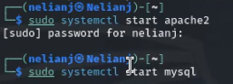{#fig:001 width=70%}

## Выполнение лабораторной работы

Я запускаю инструмент Burp Suite. После этого я открываю сетевые настройки браузера, для подготовке к работе(рис.2).

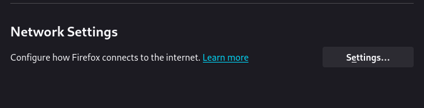{#fig:002 width=70%}

## Выполнение лабораторной работы

Я изменяю настройки сервера для работы с proxy и захватом данных с помощью Burp Suite(рис.3)

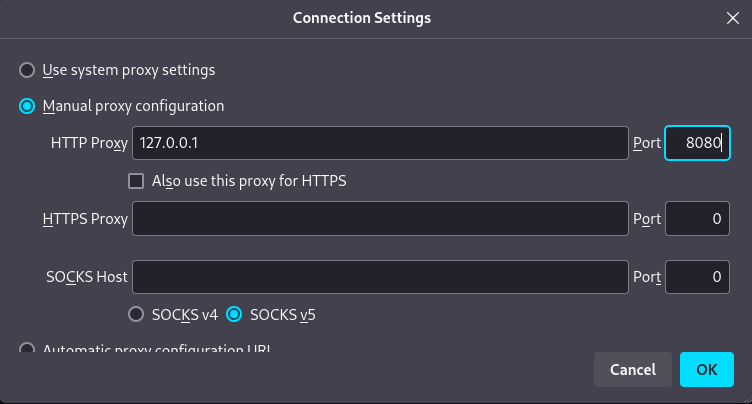{#fig:003 width=70%}

## Выполнение лабораторной работы

Я изменяю настройки Proxy инструмента Burp Suite для дальнейшей работы(рис.4).

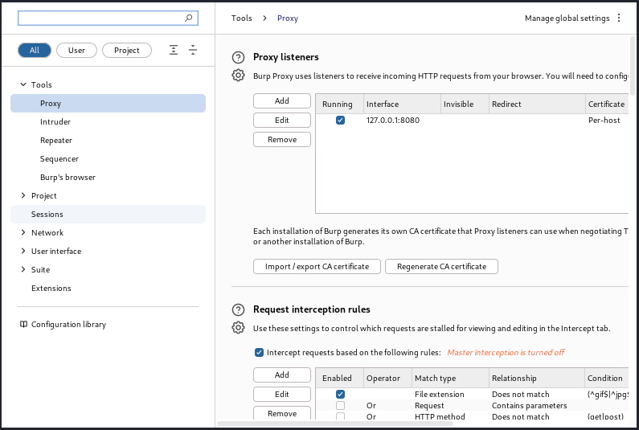{#fig:004 width=70%}

## Выполнение лабораторной работы

Во вкладке Proxy устанавливаю "Intercept is on"(рис.5).

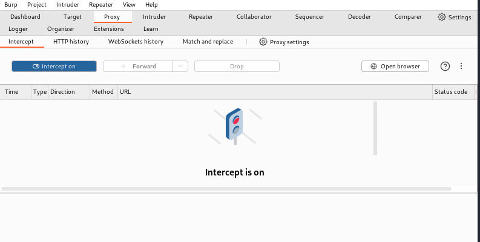{#fig:005 width=70%}

## Выполнение лабораторной работы

Чтобы Burp Suite исправно работал с локальным сервером, наобходимо установить параметр `network_allow_hijacking_loacalhost` на `true`(рис.6).

{#fig:006 width=70%}

## Выполнение лабораторной работы

Я пытаюсь зайти в браузере на DVWA, тут же во вкладки Proxy появляется захваченный запрос. Нажимаем "Forward", чтобы загрузить страницу(рис.7 и рис.8).

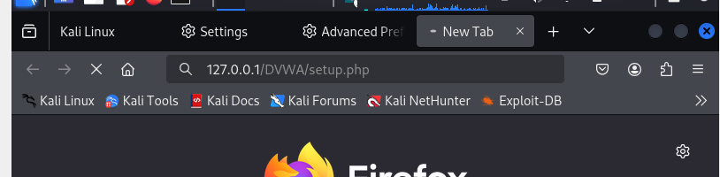{#fig:007 width=70%}

## Выполнение лабораторной работы

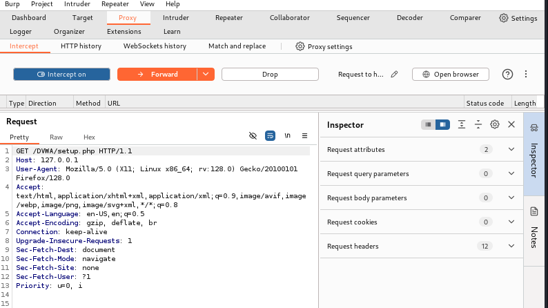{#fig:008 width=70%}

## Выполнение лабораторной работы

Загрузилась страница авторизации, текст запроса поменялся(рис.9 и рис.10).

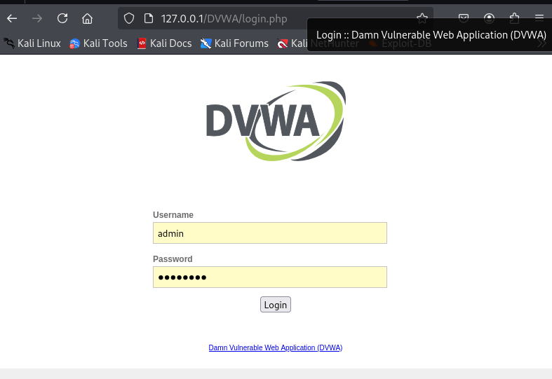{#fig:009 width=70%}

## Выполнение лабораторной работы

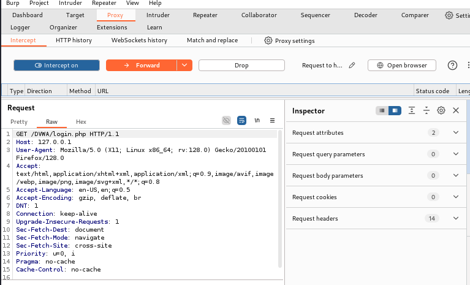{#fig:010 width=70%}

## Выполнение лабораторной работы

История запросов хранится во вкладке Target (рис.11).

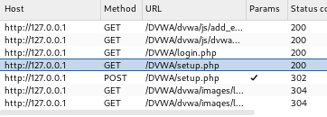{#fig:010 width=70%}

## Выполнение лабораторной работы

Я попробую ввести неправильные, случайные данные в веб-приложении и нажмем `Login`. В запросе увидим строку, в которой отображаются введенные нами данные, то есть поле для ввода(рис.12 и рис.13).

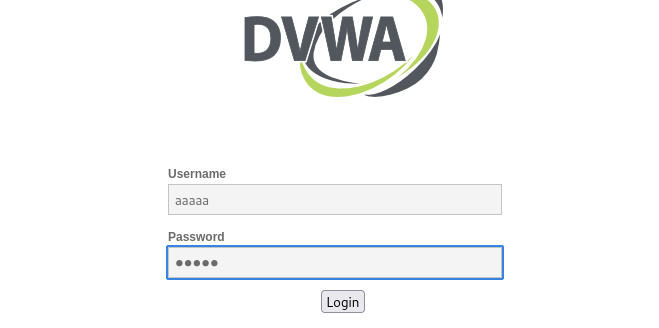{#fig:012 width=70%}

## Выполнение лабораторной работы

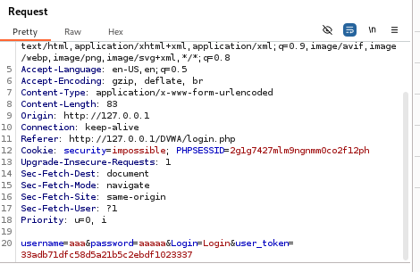{#fig:013 width=70%}

## Выполнение лабораторной работы

Этот запрос так же можно найти во вкладке Target, там же жмем правой кнопкой мыши на хост нужного запроса, и далее нажимаем "Send to Intruder"(рис.14).

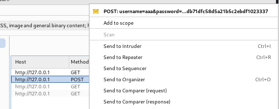{#fig:014 width=70%}

## Выполнение лабораторной работы

Я попадаю на вкладку Intruder, вижу значения по умолчанию у типа атаки и наш запрос(рис.15).

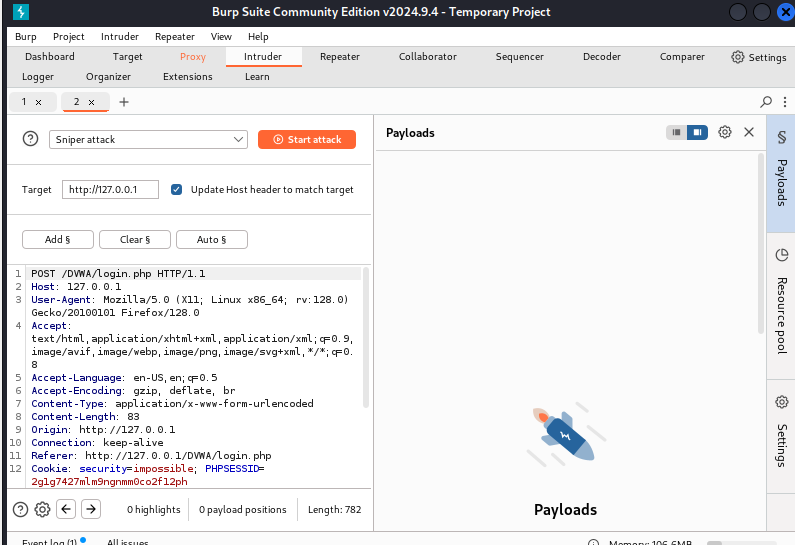{#fig:015 width=70%}

## Выполнение лабораторной работы

Я изменяю значение типа атаки на Cluster bomb и проставляю специальные символы у тех данных в форме для ввода, которые буду пробивать(рис.16).

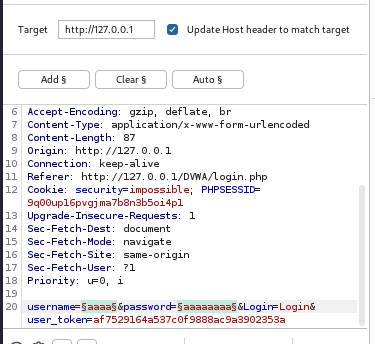{#fig:016 width=70%}

## Выполнение лабораторной работы

Так как мне нужно параметра для подбора, то нужно списка со значениями для подбора(рис.17).

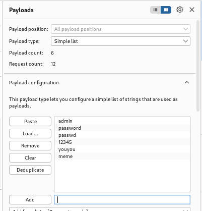{#fig:017 width=70%}

## Выполнение лабораторной работы

Я запускаю атаку и начинаю подбор(рис.18).

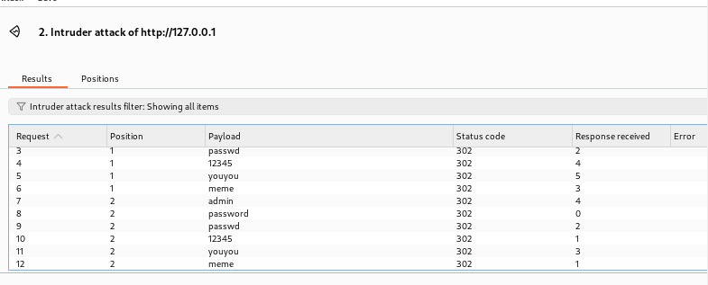{#fig:018 width=70%}

## Выполнение лабораторной работы

При открытии результата каждого post-запроса можно увидеть полученный get-запрос, в нем видно, куда нас перенаправило после выполнения ввода пары пользователь-пароль. В представленном случае с подбором пары passwd-password нас перенаправило на login.php, это значит, что пара не подходит(рис.19).

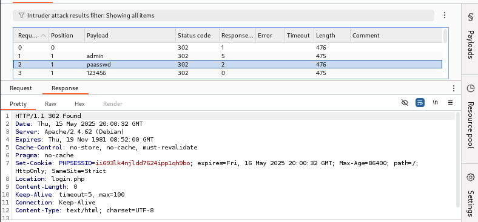{#fig:019 width=70%}

## Выполнение лабораторной работы

Я проверяю результат пары admin-password во вкладке Response, теперь нас перенаправляет на страницу index.php, значит пара должна быть верной(рис.20).

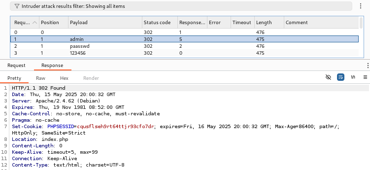{#fig:020 width=70%}

## Выполнение лабораторной работы

Дополнительная проверка с использованием Repeater, нажимаю на нужный мне запрос правой кнопкой мыши и жмем "Send to Repeater" (рис.21).

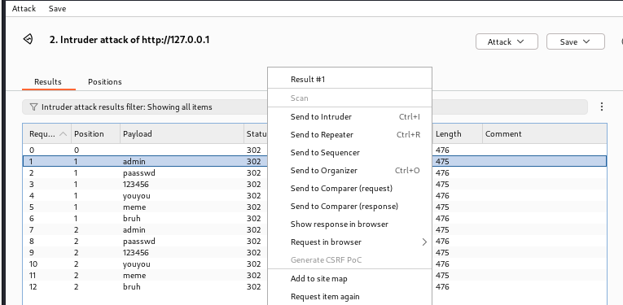{#fig:021 width=70%}

## Выполнение лабораторной работы

Я перехожу во вкладку "Repeater"(рис.22).

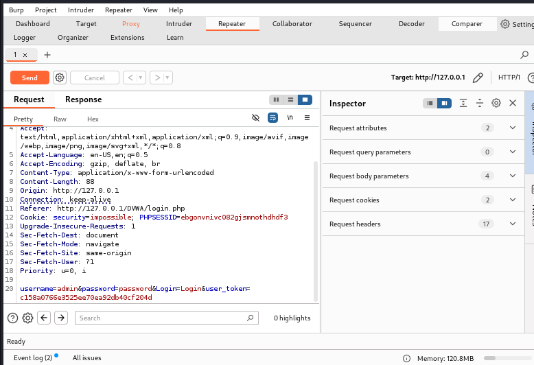{#fig:022 width=70%}

## Выполнение лабораторной работы

Нажимаю"send", получаю в Response в результат перенаправление на index.php(рис.23).

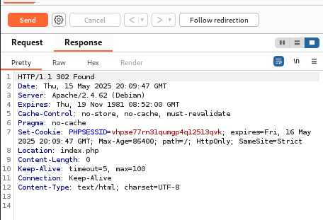{#fig:023 width=70%}

## Выполнение лабораторной работы

После нажатия на `Follow redirection`, получим нескомпилированный html код в окне Response(рис.24).

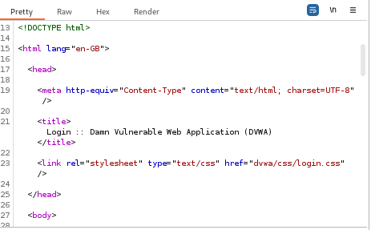{#fig:024 width=70%}

## Выполнение лабораторной работы

Далее в подокне Render получаю то, как выглядит полученная страница (рис.25).

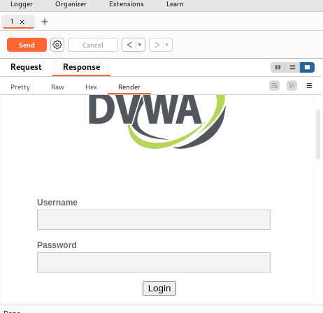{#fig:025 width=70%}

## Выводы

При выполнении лабораторной работы научилась использовать инструмент Burp Suite.
